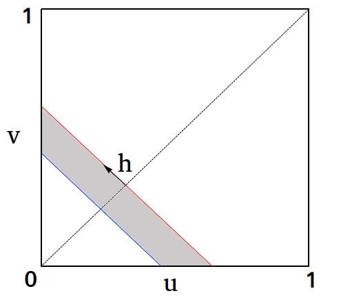

updated on `r Sys.Date()`

<!--New latex commands-->
\newcommand{\mean}{\operatorname{mean}}
\newcommand{\var}{\operatorname{var}}
\newcommand{\cor}{\operatorname{cor}}
\newcommand{\Ps}{\operatorname{P}}  
\newcommand{\Dsq}{\operatorname{D}^2}
\newcommand{\rank}{\operatorname{rank}}

<!--checkpoint package-->
```{r checkpoint_chunk, echo=F, warning=F, message=F, results="hide"}
library(checkpoint)
library(captioner)
if (!dir.exists("./.checkpoint/")){
  dir.create("./.checkpoint/")
}
checkpoint("2018-03-29",checkpointLocation = "./")
```

<!--Basic setup-->
```{r setup, echo=F}
knitr::opts_chunk$set(echo = TRUE, fig.pos = "H")
seed<-101
# families<-c(1,3:10,13,14,16:20)
source("mtime.R") #A function needed for caching
```

# Descriptions of data \label{Description_data}
<!--Each data contributor writes one to a few paragraphs about their data.-->

## Soil C and N data  \label{SoilCN_data}

Carbon and nitrogen in soil at many locations across CONUS (Terry to augment this description). The raw data are shown in Figure \ref{fig_soilCNraw}. The copula is shown in Figure \ref{fig_soilCNcop}.

<!--The raw data look like this:-->
```{r load_data_Loecke, echo=F, results='hide'}
#fig.cap="Plot of the raw soil C and N data.\\label{fig_soilCNraw}", fig.height=3, fig.width=3}
d<-readRDS("Data/RaCA_soilorganicC_soiltotalN_stocks100cm.RDS")
d<-d[,c("SOCstock100","TSNstock100")]
pdf("./Results/SoilCNraw.pdf")
plot(d[,1],d[,2],type="p",col="red",xlab="Soil C",ylab="Soil N",cex.lab=1.5,cex.axis=1.5)
dev.off()
```

<!--The copula looks like this:-->
```{r rankandplot_Loecke, echo=F, results='hide'}
#fig.cap="Copula plot of soil C and N data. Obtained by applying ranks separately to the C and N data, and then dividing the ranks by $n+1$ where $n$ is the number of sampling locations (see Sec. \ref{Model_selection}).\\label{fig_soilCNcop}",  fig.height=5, fig.width=5}
source("getcopula.R")
#convert to a copula and plot
pdf("./Results/SoilCNcop.pdf")
v_CN<-getcopula(d=d,rankon=T,ploton=T) 
dev.off()
```

{ width=30%, height=30% }

{ width=30%, height=30% }


## Phylogenetic data  \label{Phylo_data}
```{r calculation_phylo_data, echo=F, results="hide"}
source("phylo_dat_fn.R")
phylo_dat<-read.csv("./Data/Anolis/contrasts.csv",header = T)

# This plot I create on temporary basis to see the copula structure between various column of the raw data
# After I know which variables should I look into, I will modify this chunk and add model selection and NPA on that
pdf("./Results/temp_phylo_plot.pdf",width=20, height=20)
op<-par(mfrow=c(13,13))
for(i in c(1:13)){
  for(j in c(1:13)){
    v_phylo<-phylo_dat_fn(data=phylo_dat,i=i,j=j,ploton = F)
    plot(v_phylo[,1],v_phylo[,2],col="red")
    #mtext("(i,j)=(",i,", ",j,")")
    mtext(paste0(" [",i,",",j,"] ", ","," n=",dim(v_phylo)[1]),side = 3,col="blue")
  } 
}
par(op)
dev.off()
```

## Abundance data for the green spruce aphid and first flight date data for the leaf-curling plum aphid in the UK\label{Aphid_data}
   * Aphid data contains 3 measurements [count, firstflight, flight-duration] at 11 locations for 20 species and for 35 years.
   * We threw out all locations that had fewer than 30 years data 
   * We use species=10 [Name : "Green spruce aphid"] for aphid-count data 
   * We use species=11 [Name : "Leaf-curling plum aphid"] for aphid-firstflight data   
   
## Abundance data for *Ceratium furca* in UK seas \label{Pns_data}
   * Plankton North sea dataset collects data at 26 locations for 22 species and for 56 years.
   * We threw out all locations that had fewer than 45 years data
   * We use species=16 [Name : "Ceratium furca"] for Plankton_North_Sea data
   * *Ceratium furca* is a dicoflagellate commonly found in UK seas
   * note, when we edit this, we cannot call it the North Seas since data come also from other seas around the UK 
   
\newpage

# Question 1 analyses for each dataset
Recall that question 1 is: Do datasets in ecology and related fields have non-Gausian copula structure? Do they show tail dependence distinct from that of a Gaussian copula? In particular do they show asymmetric tail dependence?

## Details of methods \label{Method}

### Model selection approach \label{Model_selection}

For a bivariate dataset $(x_i,y_i)$ for $i=1,...,n$, model selection involved several steps, 
most implemented using tools from the `VineCopula` package. Code combining these tools is in the
[`OurBiCopSelect`](https://github.com/sghosh89/BIVAN/blob/master/OurBiCopSelect.R) function and its dependencies in the [`BIVAN`](https://github.com/sghosh89/BIVAN) repository. 

First, we produced ranks 
$(\tilde{u}_i,\tilde{v}_i)$ where $\tilde{u}_i$ is the rank of $x_i$ in the set 
$\{x_i:i=1,...,n\}$ and $\tilde{v}_i$ is the rank of $y_i$ in the set $\{y_i:i=1,...,n\}$ and 
we set $u_i=\tilde{u}_i/(n+1)$ and $v_i=\tilde{v}_i/(n+1)$; further work was with the $u_i$ 
and $v_i$. Ranks $\tilde{u}_i$ and $\tilde{v}_i$ were $1$, for the 
smallest element, up to $n$, for the largest. 

Second, we did a test of the independence of the $u_i$ and $v_i$. Subsequent model 
selection algorithms are ineffective if data could not be distinguished from independent data 
since most or all bivariate copula families considered include the independent copula in the 
family or as a boundary case. The independence test was as implemented in the `BiCopIndTest`
function in `VineCopula`, the documentation of which reports the test uses the asymptotic normality of the statistic $|\tau|\sqrt{\frac{9n(n-1)}{2(2n+5)}}$, where $\tau$ is Kendall's tau statistic. If independence could be rejected ($0.05$ significance level), model selection proceeded.

The third step of model selection was to fit multiple bivariate copula families to the ranked data $(u_i,v_i)$ via maximum likelihood, using the `BiCopEst` function in `VineCopula`. Families considered (with abbreviations and numeric codes here indicated) included the **N**ormal/Gaussian {1}, **C**layton {3}, **G**umbel {4}, **F**rank {5}, **J**oe {6}, **BB1** {7}, **BB6** {8}, **BB7** {9}, **BB8** {10}, **S**urvival **C**layton {13}, **S**urvival **G**umbel {14}, **S**urvival **J**oe {16}, **S**urvival **BB1** {17}, **S**urvival **BB6** {18}, **S**urvival **BB7** {19} and **S**urvival **BB8** {20} copulas.
Akaike Information Criterion (AIC) and Bayesian Information Criterion (BIC) values and accompanying model weights ($\text{AIC}_{\text{w}}$, $\text{BIC}_{\text{w}}$) were generated using standard formulas [@burnham2003_modelselection]. 
Descriptions of these copula families can be found in introductory texts on copulas [@nelsen2007_copula ; @joe2014_dependence]  and in references cited in `VineCopula`. The lower- and upper-tail dependence of the 
best-fitting member of each family was also provided by `BiCopEst`.

Model selection methods will give the *relative* support of several models, but will not,
on their own, indicate whether any of the models selected is an objectively good fit (all 
models considered might poorly describe the data). To test this, and as the fourth step of
our procedure, we tested the goodness of fit of our best-AIC copula family using a 
bootstrapping procedure implemented in `BiCopGofTest` of `VineCopula`. The method performed 
two tests, one based on a Cramer-von Mises statistic, and one based on a 
Kolmogorov-Smirnov statistic. For computational efficiency, 
an initial run using $100$ bootstraps was performed, and if
the $p$-value resulting from either test was less than $0.2$, tests were re-run with 
$1000$ boostraps.

Finally, $\text{AIC}_{\text{w}}$ values for all fitted models were used to get
model-averaged lower- and upper-tail dependence values using standard model averaging 
formulas [@burnham2003_modelselection]; likewise for BIC.

<!--Shya please insert some additional material for multivariate datasets - perhaps
you don't need much because basically you just ran the bivariate analysis on each pair
of locations, but you need to say that and then maybe a few sentences about how 
everything was tallied up after having done that ??? -->

### Non-parametric analysis of tail dependence \label{NPA}

Left- and right-tail dependence quantify the extent to which two ranked
variables $u_i$, $v_i$ for $i=1,...,n$ 
(see Sec. \ref{Model_selection} for defintions of $u_i$ and $v_i$)
are related in the left and right tails, respectively, of their 
distributions [@nelsen2007_copula]. 
Our nonparametric study of tail dependence uses three
statistics which can quantify the extent to which $u_i$ and $v_i$ are 
related in any part of their distributions. We here describe the 
statistics. The statistics were formulated with positively associated
variables in mind. All the variables we study are positively associated
when they are significantly associated. So definitions and associated 
diagrams will assume positive associations, though generalizations are 
possible. Given two bounds 
$0 \leq l_b < u_b \leq 1$, we define the parallel lines $u+v=2l_b$ and 
$u+v=2u_b$ which intersect the unit square in which the $u_i$ and $v_i$ 
fall (these are the blue and red lines, respectively, in 
Figure \ref{fig_stat_image}). Our statistics quantify the dependence
between $u_i$ and $v_i$ in the region bounded by these lines.
Using $l_b=0$ and some value $u_b\leq 0.5$ can give information about 
dependence in the left parts of the distributions of $u$ and $v$, and 
using $u_b=1$ and $l_b \geq 0.5$ can give information about dependence in 
the right parts of the distributions. 

{ width=25%, height=25% }

The first quantity, $\cor_{l_b,u_b}(u,v)$, is the portion of the Spearman 
correlation of $u_i$ and $v_i$ that is attributable to the points 
lying in the region given by the bounds $u+v=2l_b$ and $u+v=2u_b$, i.e.,
\begin{equation}\label{eq.Cor}
   \cor_{l_b,u_b}(u,v) = \frac{1}{(n-1)\sqrt{\var(u)\var(v)}}\sum 
   (u_i-\mean(u)) (v_i-\mean(v)),
\end{equation}
where means and variances are computed using all $n$ data 
points, but the
sum is over only the indices $i$ for which $u_i+v_i > 2l_b$ and 
$u_i+v_i < 2u_b$. 
Larger values of $\cor_{l_b,u_b}$ indicate stronger positive association
between $u$ and $v$ in the region given by the bounds.

We also defined a statistic $\Ps_{l_b,u_b}$, using the same bounds
$u+v=2l_b$ and $u+v=2u_b$, as follows. For a distance $h$, we defined
$S(h)$ to be the number of points $(u_i,v_i)$ within the bounds 
and a distance less than $h$ from the line $v=u$, divided by the 
total number of points within the bounds. This function is
defined for $h$ going from $0$ to a distance $h_{\text{max}}$ which
is half the longer of the two segments obtained by intersecting the
bounds with the unit square. It is easy to see $S(0)=0$ and 
$S(h_{\text{max}})=1$. We defined $S_i(h)$, for the same range 
of $h$, to be the area within the bounds and the unit square
and within distance $h$ of the line $v=u$, divided by the area
within the bounds and the unit square. This is the expected value of
$S(h)$ for independent data. We then defined
\begin{equation}\label{eq.P}
   P_{l_b,u_b} = \int_0^{h_{max}} ( S(h) - S_i(h) ) dh.
\end{equation}
As for $\cor_{l_b,u_b}$, larger values of $\Ps_{l_b,u_b}$ 
indicate stronger positive association
between $u$ and $v$ in the region given by the bounds.

The third statistic, $\Dsq_{l_b,u_b}(u,v)$, is the average squared 
distance between points satisfying $u_i+v_i>2l_b$ and 
$u_i+v_i<2u_b$ and the line $v=u$. Unlike $\cor_{l_b,u_b}$ and 
$\Ps_{l_b,u_b}$, which are large when points satisfying $u_i+v_i>2l_b$ and 
$u_i+v_i<2u_b$ cluster close to the line $v=u$, $\Dsq_{l_b,u_b}$ is 
then small. 
Thus large values of $\cor_{l_b,u_b}$ and $\Ps_{l_b,u_b}$ indicate strong 
dependence in the portions of the distributions of $u$ and $v$ given by 
the bounds $u_i+v_i>2l_b$ and $u_i+v_i<2u_b$, whereas small values of 
$\Dsq_{l_b,u_b}$ indicate strong dependence. 

For large datasets (i.e., datasets with large $n$),
we can consider $l_b$ and $u_b$ close together without incurring undue
sampling variation in our statistics, and we can consider 
several different bands $(l_b,u_b)$ to understand how dependence
varies in different parts of the distributions. But for datasets with 
smaller $n$ we considered only $l_b=0$, $u_b=0.5$ and $l_b=0.5$, $u_b=1$.
We use the shorthand $\cor_l=\cor_{0,0.5}$ ($l$ is for "lower") 
and $\cor_u=\cor_{0.5,1}$ ($u$ is for "upper"); likewise $\Ps_l=\Ps_{0,.5}$,
$\Ps_u=\Ps_{0.5,1}$, $\Dsq_l=\Dsq_{0,0.5}$, and $\Dsq_u=\Dsq_{0.5,1}$.

The difference $\cor_l-\cor_u$ is expected to be positive if 
dependence in the left halves of the distributions is stronger 
than dependence in their right halves; likewise for $\Ps_l-\Ps_u$.
This holds, for instance, for the Clayton copula [@nelsen2007_copula].
The difference $\Dsq_u-\Dsq_l$, in which the "upper" and
"lower" statistics occur in opposite order, is also expected to be 
positive under the same conditions. We use these three differences
to detect asymmetry of tail dependence. Likewise, for large datasets,
we consider $\cor_{l_b,u_b}-\cor_{1-u_b,1-l_b}$, 
$\Ps_{l_b,u_b}-\Ps_{1-u_b,1-l_b}$ and
$\Dsq_{1-u_b,1-l_b}-\Dsq_{l_b,u_b}$ with $l_b=0$ and $u_b$ close to $0$.

In addition to [basic unit tests](https://github.com/sghosh89/BIVAN/blob/master/Tests.Rmd), we 
also tested our statistics by testing whether $\cor_l-\cor_u$, $\Ps_l-\Ps_u$, and 
$\Dsq_u-\Dsq_l$ revealed the asymmetry of tail dependence known to be present in data simulated
from various copulas. Normal and Frank copula families 
are known to have symmetric tail dependence,
i.e., strengths of dependence in the lower and upper tails are the same, for all copulas
in these families [@nelsen2007_copula]. Clayton copulas are known to have stronger lower- than 
upper-tail dependence. And survival Clayton copulas, being rotations of Clayton copulas by 
$180^\circ$, have stronger upper- than lower tail dependence [@nelsen2007_copula].
Using the `iRho` function from the `copula` package, for each of the four families normal, 
Frank, Clayton, and survival Clayton, we obtained parameters for which the expected value of 
Spearman's $\rho$ was, separately, $0,0.1,0.2,...,0.9$. For each copula family and for each 
of the selected parameter values we generated  $n$ points, 100 times, and thereby computed 100 values of the 
statistics $\cor_l-\cor_u$, $\Ps_l-\Ps_u$, and $\Dsq_u-\Dsq_l$. This exercise 
was repeated, separately, 
for $n=1000$ and for $n=35$, these cases being chosen, respectively, to reflect asymptotic behavior of the 
statistics and their behavior on the small datasets which are common in some fields
of ecology. The mean and standard error of the three difference statistics were computed for 
each copula family, parameter value, and value of $n$, and results were plotted against 
Spearman's rho (Figures \ref{fig_stat_testing35} and \ref{fig_stat_testing1000}), 
the expectation being that the difference statistics would be positive for 
Clayton copulas and negative for survival Clayton copulas (except for the case of $\rho=0$, a 
boundary case of these families corresponding to independence), and not significantly different 
from $0$ (we used a $t$-test with a significance threshold of $0.05$) for Frank and normal 
copulas. These expectations were fullfilled (Figures \ref{fig_stat_testing35} and 
\ref{fig_stat_testing1000}).

<!--The message=F and warning=F flags are to suppress warnings that come when you pass a parameter
of 0 to the Frank or Clayton copulas. These are technicallly boundary cases for these families.
They correspond to the independent copula. The packages we use provide the indepdent copula, but
issue a warning. Since anyway we want the independent copula, we can suppress the warning. We ran this
without the warning and it is OK to supress it.-->
<!-- The lines you are talking about appeared as message not as warning(actualy no warning appered for this chunk), so we have to set message=F here-->
```{r stat_testing_save_and_plot_result, message=F, results="hide", echo=F, cache=T, cache.extra=list(seed,mtime("TestStats_multivar_dataset.R"),mtime("CopulaFunctions.R"),mtime("CopulaFunctions_flexible.R"))}
source("TestStats_multivar_dataset.R")
set.seed(seed)

resultsloc<-"./Results/stat_results/stat_testing/"
spearvals<-seq(from=0,to=0.9,by=0.1)
callfn<-coplist_with_params(spearvals=spearvals)
coplist<-callfn$coplist
ncores<-3
res_pt35_rankF<-mclapply(X=coplist,FUN=worker,numpts=35,numsims=100,rank=F,mc.cores=ncores)
res_pt35_rankT<-mclapply(X=coplist,FUN=worker,numpts=35,numsims=100,rank=T,mc.cores=ncores)
res_pt1000_rankF<-mclapply(X=coplist,FUN=worker,numpts=1000,numsims=100,rank=F,mc.cores=ncores)
res_pt1000_rankT<-mclapply(X=coplist,FUN=worker,numpts=1000,numsims=100,rank=T,mc.cores=ncores)
save(res_pt35_rankF,res_pt35_rankT,res_pt1000_rankF,res_pt1000_rankT,file=paste(resultsloc,"StatTestNumericResults.RData",sep=''))

b<-callfn$paramlist
plotter_stat_testing(res_pt35_rankF,"res_pt35_rankF",b,resultsloc,spearvals)
plotter_stat_testing(res_pt35_rankT,"res_pt35_rankT",b,resultsloc,spearvals)
plotter_stat_testing(res_pt1000_rankF,"res_pt1000_rankF",b,resultsloc,spearvals)
plotter_stat_testing(res_pt1000_rankT,"res_pt1000_rankT",b,resultsloc,spearvals)
```


For bivariate datasets such as the soil C and N data, we compared values of the statistics $\cor_{l_b,u_b}$,
$\Ps_{l_b,u_b}$, $\Dsq_{l_b,u_b}$, $\cor_l-\cor_u$, $\Ps_l-\Ps_u$, and $\Dsq_u-\Dsq_l$ to distributions of values of the same 
statistics computed on surrogate datasets that 
were produced from the empirical data by randomizing it in a special way. The surrogate/randomized datasets had exactly 
the same marginal distributions as the empirical data and had very similar Kendall or Spearman correlation, but had
normal copula structure, and thus our comparisons tested the null hypothesis that our statistics took values on the
empirical data no different from what would have been expected if the copula structure of the data were normal, but the
data were otherwise statistically unchanged.
For bivariate datasets, surrogates were produced as follows.   

- Given data $(x_i,y_i)$ for $i=1,\ldots,n$ and a 
one-parameter target copula family $\mathcal{B}(\theta)$ (here $\theta$ denotes the parameter), let $\tau$ be the
Kendall correlation of the $x_i$ with the $y_i$ and find the parameter value $\theta_\tau$ for which 
$\mathcal{B}(\theta_\tau)$ has Kendall correlation $\tau$ (this is possible for the one-parameter copula families of this 
study using the `iTau` function of the `VineCopula` package). 
- Generate data $(a_i,b_i)$, $i=1,\ldots,n$ from 
$\mathcal{B}(\theta_\tau)$. 
- Permute the ordered set $(x_1,\ldots,x_n)$ such that the permutation
$(x_{\sigma_x(1)},\ldots,x_{\sigma_x(n)})$ has $\rank(x_{\sigma_x(i)})$ equal to $\rank(a_i)$ for all $i$, where 
$\rank(x_{\sigma_x(i)})$ is the rank of $x_{\sigma_x(i)}$ in the set $(x_{\sigma_x(1)},\ldots,x_{\sigma_x(n)})$, and
$\rank(a_i)$ is the rank of $a_i$ in the set $(a_1,\ldots,a_n)$ (here $\sigma_x$ is a permutation of the 
indices $1,\ldots,n$). 
- Likewise permute $(y_1,\ldots,y_n)$
such that the permutation
$(y_{\sigma_y(1)},\ldots,y_{\sigma_y(n)})$ has $\rank(y_{\sigma_y(i)})$ equal to $\rank(b_i)$ for all $i$ ($\sigma_y$ is 
another permutation of $1,\ldots,n$).
- The surrogate dataset is $(x_{\sigma_x(i)},y_{\sigma_y(i)})$ for $i=1,\ldots,n$. 

Our code for this algorithm is [`copsurrog2d`](https://github.com/sghosh89/BIVAN/blob/master/copsurrog2d.R) in the 
[`BIVAN`](https://github.com/sghosh89/BIVAN) repository. 

Because $(x_{\sigma_x(1)},\ldots,x_{\sigma_x(n)})$ 
is a permutation of $(x_1,\ldots,x_n)$ and $(y_{\sigma_y(1)},\ldots,y_{\sigma_y(n)})$ is a permutation 
of $(y_1,\ldots,y_n)$, the marginal distributions of the surrogate data are exactly the same as those of the original data. 
Because ranks of the surrogate data are matched to ranks of the $a_i$ and $b_i$, the
Kendall correlation of the surrogate dataset will be the same as that of the $a_i$ and $b_i$, and therefore 
will be close to $\tau$ (differences arising only through sampling variation). If instead of $\theta_\tau$
a parameter value $\theta_\rho$ is used such that the Spearman correlation of $\mathcal{B}(\theta_\rho)$ is the same
as that of the $x_i$ with the $y_i$, then Spearman correlations of surrogates will very nearly equal (except for 
sampling variation) the Spearman correlation of the empirical data.  

The comparison of one of the
statistics $\cor_{l_b,u_b}$, $\Ps_{l_b,u_b}$, $\Dsq_{l_b,u_b}$, as computed on the empirical data, to the distribution
of its values computed on many surrogate datasets produced using the normal copula family for $\mathcal{B}(\theta)$
provides a test of whether dependence in the part of the distribution specified by $l_b$ and $u_b$ is different from
what would be expected from a null hypothesis of normal copula structure but unchanged marginals and unchanged 
Kendall (or Spearman)
correlation. Significant deviations correspond to deviations from normal copula structure. In particular, deviations 
using $l_b=0$ and $u_b$ small (say, $0.1$) correspond to lower tail dependence different from that of a normal copula;
likewise, using $l_b=0.9$ and $u_b=1$ tests for upper tail dependence different from that of a normal copula.  
The comparison of one of the statistics $\cor_l-\cor_u$, $\Ps_l-\Ps_u$, $\Dsq_u-\Dsq_l$, as computed on the 
empirical data, to the distribution
of its values computed on many surrogate datasets produced using the normal copula family for $\mathcal{B}(\theta)$
provides a test of asymmetry of tail dependence. 

For multivariate datasets, e.g., the aphid abundance or first flight data, each of which consists of time series 
from 10 locations, a spatial resampling scheme was used instead of the surrogate approach described above.
The scheme is identical to that proposed by [@bjornstadfalck2001] for application in their now 
widely used spline correlogram method; the same scheme was also used by [@walteretal2017] as part of a method for 
performing model selection among matrix regression models. For each pair of locations $i \neq j$, the statistic
of interest, here denoted $s_{ij}$ ($\cor_{l_b,u_b}$, $\Ps_{l_b,u_b}$, $\Dsq_{l_b,u_b}$, $\cor_l-\cor_u$, 
$\Ps_l-\Ps_u$, or $\Dsq_u-\Dsq_l$) was computed for those locations. The values $s_{i,j}$ were then arranged in
a matrix, $S$, with diagonal entries NA. The mean of the non-NA entries of $S$ was computed. For 
$\cor_{l_b,u_b}$, $\Ps_{l_b,u_b}$, or $\Dsq_{l_b,u_b}$ this mean characterized the average strength of 
dependence, across all pairs of distinct locations, for data in the portion of the distributions 
given by $l_b$ and $u_b$. For $\cor_l-\cor_u$, $\Ps_l-\Ps_u$, or $\Dsq_u-\Dsq_l$, the mean characterized average
asymmetry of tail dependence across all pairs of locations. 
Confidence intervals for the values of $\mean(S)$ were then computed as quantiles of a distribution of bootstrapped values.
Bootstrapping was performed by resampling the locations of measurement, with replacement; this corresponds to 
resampling, with replacement, the rows and columns of $S$, and is described in detail elsewhere 
[@bjornstadfalck2001 ; @walteretal2017]. 

\newpage

## Results: soil C and N data \label{Ex_SoilCN}

### Model selection approach \label{Ex_SoilCN_Model_selection}
<!--This does the computations for this section-->
```{r bivmodselect_Loecke, echo=F, cache=T, cache.extra=list(seed,v_CN,mtime("OurBiCopSelect.R"),mtime("MyBiCopGofTest.R"),mtime("preprocessors.R"))}
source("OurBiCopSelect.R")
set.seed(seed)
families_Loecke<-c(1,3:10,13:14,16:20) 
BivMS_res_Loecke<-OurBiCopSelect(u1=v_CN[,1],u2=v_CN[,2],families=families_Loecke,level=0.05,AICBIC="AIC",numBSsmall=100,pthresh=0.2,numBSlarge=1000,gofnormal=F,status=F)
```

The test of indepedence gave $p=$ `r BivMS_res_Loecke$IndepTestRes` (to within the precision available 
from `BiCopIndTest` in the `VineCopula` package). We fitted several copulas
and got AIC values and upper- and lower-tail dependency estimates based on the fitted copulas (Table \ref{tab_soilCNfit}). The table shows that several copulas are much better supported (higher AIC and BIC weights) than the Gaussian copula, answering the first part of question 1 for these data.

<!--Display model selection results in a table-->
```{r tab_soilCNfit,echo=F,results='markup'}
h<-BivMS_res_Loecke$InfCritRes[,c("copname","AICw","BICw","LTdep","UTdep")]
knitr::kable(h,
             format='pandoc',
             caption = "Fitting info for soil C and N dataset. Here and henceforth copula names are abbreviated as: N=normal (Gaussian); C=Clayton; G=Gumbel; F=Frank; J=Joe; SC=survival Clayton; SG=survival Gumbel; SJ=survival Joe. An S in front of one of the copulas BB1, BB6, BB7, BB8 indicates the survival version of that copula (rotation by $180^\\circ$).\\label{tab_soilCNfit}",
             booktabs=T)
```

The model-averaged (AIC weights used for model averaging) lower-tail dependence statistic was `r BivMS_res_Loecke$relLTdep_AICw` and the model-averaged upper-tail dependence statistic was `r BivMS_res_Loecke$relUTdep_AICw`. These values are distinct from what a Gaussian copula would give (i.e., 0), answering the second part of question 1 for these data. Furthermore, the difference of these two quantities (lower minus upper), `r BivMS_res_Loecke$relLTdep_AICw-BivMS_res_Loecke$relUTdep_AICw`, was different from 0, answering the third part of question 1. 

Although these results do convincingly show non-Gaussian copula structure, we should take the tail dependence results with a grain of salt because even the lowest-AIC copula was a poor fit, giving $p$-value `r BivMS_res_Loecke$GofRes_CvM` (to within the precision available from `BiCopGofTest` in the `VineCopula` package) in the Cramer-von Mises-based test of the goodness of its fit, and $p$-value `r BivMS_res_Loecke$GofRes_KS` in the Kolmogorov-Smirnov-based test of the goodness of fit. The next section looks at tail dependence in a non-parametric way.

### Non-parametric analysis of tail dependence \label{Ex_SoilCN_NPA}

```{r stat_soilCN_graphic_approach, echo=F, results="hide", cache=T, cache.extra=list(seed,v_CN,mtime("bivfunctionplot.R"),mtime("CopulaFunctions_flexible.R"),mtime("copsurrog2d.R"))}
source("bivfunctionplot.R")
set.seed(seed) 
stat_soilCN_ga<-bivfunctionplot(v=v_CN,resloc="./Results/stat_results/stat_soilCN/",nametag="soilCN",numbin=10)
```

As described in Methods, each of our statistics, as computed for the 
ranges $0-0.1$, $0.1-0.2$, ..., $0.9-1$, was compared to the distributions 
of values of the same statistic with the same ranges computed on 1000 normal-copula 
surrogate datasets with similar Kendall or Spearman correlations, in different 
runs for Kendall and Spearman (Figure \ref{fig_soilCN_nonparam}). Because the correlation 
used in the $\cor$ statistic is the Spearman correlation, Spearman-preserving surrogates
should be used, so the top-right panel of Figure \ref{fig_soilCN_nonparam}
is more reliable than the top left. Results indicate that tail dependence of 
data is stronger in both the lower and upper tails than would be expected under a 
null hypothesis of a normal copula, answering the second part of question 1. The dependence between C and N is also 
weaker in the middle of the distributions
than would be expected based on a normal-copula null model.

![Nonparametric tests for tail dependence and other deviations from a normal copula for soil C and N data. As described in Methods, each statistic was computed on the data using the ranges $0-0.1$, $0.1-0.2$, ..., $0.9-1$ (red lines), and was also computed using the same ranges for 1000 normal-copula surrogate datasets (dashed lines show 0.025 and 0.975 quantiles of these results and dotted lines show 0.005 and 0.995 quantiles).  When red lines were outside dashed lines, text at the top of plots indicates how many surrogate values the data value was less than or greater than. When $\cor$ values (respectively, $\Ps$ or $\Dsq$ values) were greater than surrogates, it means dependence in that part of the distributions was stronger than (respectively, stronger than or weaker than for $\Ps$ or $\Dsq$) expected from a normal-copula null hypothesis. \label{fig_soilCN_nonparam}](./Results/stat_results/stat_soilCN/soilCN_bivfunctionplot.pdf)

We also tested statistically for asymmetry of tail dependence, which seems visible in Figure \ref{fig_soilCNcop}. 
Results (Table \ref{tab_soilCN_asym}) show that upper-tail dependence was, indeed, significantly stronger than lower-tail dependence in these data, answering the third part of question 1.

<!--Now make and display a table, this one about asymmetry of tail dependence-->
```{r make_table_stat_fn, echo=F}

fractxt<-function(fracval,numsurrog=1000){
  ptxt<-''
  if (fracval>.5*numsurrog){                        # why 0.5 factor?
    ptxt<-paste(">",fracval,sep='')
  } 
  if (fracval<=.5*numsurrog){
    ptxt<-paste("<",numsurrog-fracval,sep='')
  }
  return(ptxt)
}

make_table_stat_fn<-function(data){
  
 atdres<-data.frame(Statistic=c("$\\cor_{0,0.1}-\\cor_{0.9,1}$","$\\Ps_{0,0.1}-\\Ps_{0.9,1}$","$\\Dsq_{0.9,1}-\\Dsq_{0,0.1}$"),
                   Kendall=rep("",3),
                   Spearman=rep("",3),stringsAsFactors = F)
 
 atdres[1,2]<-fractxt(data$corlmcoru_frac_K)
 atdres[1,3]<-fractxt(data$corlmcoru_frac_S)
 atdres[2,2]<-fractxt(data$PlmPu_frac_K)
 atdres[2,3]<-fractxt(data$PlmPu_frac_S)
 atdres[3,2]<-fractxt(data$D2umD2l_frac_K)
 atdres[3,3]<-fractxt(data$D2umD2l_frac_S)

 return(atdres)
  
}
```

```{r tab_soilCN_asym, echo=F, results="markup"}
tab_soilCN_asym<-make_table_stat_fn(data=stat_soilCN_ga)
knitr::kable(tab_soilCN_asym,
             format="pandoc",
             caption = "Results for tests of whether asymmetry of tail dependence was significant compared to a normal-copula null hypothesis. Three statistics are listed in the left column that measured asymmetry of tail dependence by comparing the distribution ranges $0-0.1$ and $0.9-1$ (Methods). One thousand Kendall-preserving and 1000 Spearman-preserving surrogates with normal copula structure were created, and the same statistics were computed for the surrogates. A table entry $<N$ indicates the value of the given statistic on the data was less than its value on $N$ of the surrogates, so entries of the form $<X$ for $X$ equal to $975$ or above indicate that upper-tail dependence was significantly stronger than lower-tail dependence. Recall that Spearman-preserving surrogates are more appropriate for the $\\cor$ statistic (Figure \\ref{fig_soilCN_nonparam} caption).\\label{tab_soilCN_asym}",
             booktabs=T)
```

## Results: BMR data \label{Ex_BMR}

```{r read_plot_BMR_data, echo=FALSE}
set.seed(seed=101)
source("phylo_dat_fn.R")
#---------------------------------------------------------
BMR_dat<-read.csv("./Data/BMR/bmr-contrasts.csv",header = T)
#class(BMR_dat)
v_BMR<-phylo_dat_fn(data=BMR_dat,i=4,j=3,ploton = F) 

pdf("./Results/BMR_results/BMR_vs_lnmass.pdf")
plot(v_BMR[,1],v_BMR[,2],col="blue",xlab="ln(mass)",ylab="BMR") # copula plot btw ln(Mass) vs. BMR
dev.off()
```

### Model selection approach \label{Ex_BMR_Model_selection}

```{r bivMS_BMR, echo=F, cache=T, cache.extra=list(seed,v_BMR,mtime("OurBiCopSelect.R"),mtime("MyBiCopGofTest.R"),mtime("preprocessors.R"))}
set.seed(seed)
source("OurBiCopSelect.R")
#families<-c(1,3:10,13:14,16:20) 
BivMS_BMR<-OurBiCopSelect(u1=v_BMR[,1],u2=v_BMR[,2],families=c(1,3:10,13:14,16:20),
                          level=0.05,AICBIC="AIC",numBSsmall=100,pthresh=0.2,numBSlarge=1000,gofnormal=F,status=F)
saveRDS(BivMS_BMR,file="./Results/BMR_results/BivMS_BMR_lnmass.RDS")
```

### Non-parametric analysis of tail dependence \label{Ex_BMR_NPA}

```{r stat_BMR_graphic_approach, echo=F, results="hide", cache=T, cache.extra=list(seed,v_BMR,mtime("bivfunctionplot.R"),mtime("CopulaFunctions_flexible.R"),mtime("copsurrog2d.R"))}
source("bivfunctionplot.R")
set.seed(seed) 
# Now do NPA for v_BMR
# If "F"/"SBB8" is the best fit : then it should be symmetric tail dep (0) : Then still I need to do NPA ?
# May be : because it will also tell me how they are different from "N" copula in different sections?
source("bivfunctionplot.R")
stat_BMR_ga<-bivfunctionplot(v=v_BMR,resloc="./Results/BMR_results/",nametag="BMR",numbin = 10)
```

```{r }
tab_BMR_asym<-make_table_stat_fn(data=stat_BMR_ga)
knitr::kable(tab_BMR_asym)
```

\newpage

## Results: abundance data for the green spruce aphid, *Elatobium abietinum* \label{Ex_count}

### Model selection approach \label{Ex_count_Model_selection}

<!--Load the raw data-->
```{r read_aphid_data, echo=F}
source("aphid_data_calling.R")

# Aphid raw data for count
d0_count<-as.matrix(read.csv("./Data/Aphid_data/APHID_DATA_RAW/aphidtscount141117.csv",header=F))
data_aphid_count<-d_allsp_data(d0_count)     
 
# Aphid raw data for first flight
d0_firstflight<-as.matrix(read.csv("./Data/Aphid_data/APHID_DATA_RAW/aphidtsfirstflight141117.csv",header=F))
data_aphid_ff<-d_allsp_data(d0_firstflight) 

# Aphid raw data for flight duration   
#d0_flightduration<-as.matrix(read.csv("./Data/Aphid_data/APHID_DATA_RAW/aphidtsflightduration141117.csv",header=F))
```

<!--Do the calculations-->
```{r RES_aphid_count, echo=F, cache=T, cache.extra=list(seed,data_aphid_count,mtime("FittingCopula_selective_loc.R"), mtime("vivj_matrix.R"),mtime("good_loclist.R"),mtime("OurBiCopSelect.R"),mtime("MyBiCopGofTest.R"),mtime("preprocessors.R"))}

source("FittingCopula_selective_loc.R")  # top most hierarchy source file
set.seed(seed)
#cat(paste("start-time: ",Sys.time(),"\n")) 
RES_aphid_count<-RES_single_sp(d_allsp=data_aphid_count,sp=10,families=c(1,3:10,13,14,16:20),level=0.05,data_pt_thrs=30)
#cat(paste("stop-time: ",Sys.time(),"\n"))
resloc<-"./Results/fitting_results/"
saveRDS(RES_aphid_count,paste(resloc,file="AphidCopulaFit_selecloc_count_species_10.RDS",sep=""))
```

As described in Methods, model selection among copulas was done separately for each pair of the 10 
sampling locations, thus results are presented in $10 \times 10$ matrix format with rows and columns 
corresponding to locations. Table \ref{tab_count_bestcop} shows that, for the large majority of location 
pairs, some non-normal copula was a better fit, according to AIC, than was the normal copula, answering the first part of 
question 1 for these data. Comparing the 
AIC weight of the best-fitting (lowest AIC) copula family for each pair of sampling locations (Table \ref{tab_count_AICw}) 
to the AIC weight 
of the normal copula family for the same pair (Table \ref{tab_count_AICw_normal}) confirms that the degree of support for normal copulas was usually not
comparable to the degree of support for other families.
Goodness of fit tests based on a Cramer-von Mises statistic (Table \ref{tab_count_p_CvM}) in every case 
failed to reject the hypothesis that the AIC-best copula family was also an objectively adequate description of 
the data, and likewise for goodness of fit tests based on a Kolmogorov-Smirnov statistic (Table \ref{tab_count_p_KS}),
demonstrating that the collection of copula families we used was sufficiently broad that the copulas of 
all pairs of locations could be characterized by at least one of them. In all cases at least `r min((RES_aphid_count$gfc_numBS_success/RES_aphid_count$gfc_numBS),na.rm=T)*100` percent of bootstrap randomizations used for goodness of fit tests successfully lead to values of the statistic for comparison with its value on the real data.

```{r read_RES_aphid_count, echo=F}
RES_aphid_count<-readRDS("./Results/fitting_results/AphidCopulaFit_selecloc_count_species_10.RDS")
```

```{r tab_count_bestcop, echo=F, results='markup'}
#library(dplyr)
knitr::kable(RES_aphid_count$info_ord_copname[,,1], 
             format='pandoc',
             caption = "Best-fitting copulas for each location pair from among those considered, according to AIC, for abundances of the green spruce aphid. Copulas 
considered were the normal, Clayton, Gumbel, Frank, Joe, BB1, BB6, BB7, BB8, survival Clayton, survival Gumbel, 
survival Joe, survival BB1, survival BB6, survival BB7, survival BB8 copulas. Abbreviations were given in Methods. NA occurs along the diagonal of the matrix because the diagonal represents a sampling location compared to itself.\\label{tab_count_bestcop}",
             booktabs=TRUE
             )#%>% # only with 'latex'/'html' format
 # kableExtra::kable_styling(latex_options = c("striped","HOLD_position"))
```

```{r tab_count_AICw, echo=F, results='markup'}
knitr::kable(RES_aphid_count$info_ord_AICw[,,1], 
             format='pandoc',
             caption = "$\\text{AIC}_{\\text{w}}$ for the best-fitting (lowest AIC) copula family for each location pair for abundances of the green spruce aphid.\\label{tab_count_AICw}",
             booktabs=TRUE
             )
```

```{r tab_count_AICw_normal, echo=F, results='markup'}
source("normal_cop_AICw.R")
knitr::kable(normal_cop_AICw_matrix(r=RES_aphid_count),
             format='pandoc',
             caption = "$\\text{AIC}_{\\text{w}}$ for the normal copula family for each location pair for abundances of the green spruce aphid, for comparison with Table \\ref{tab_count_AICw}. \\label{tab_count_AICw_normal}",
             booktabs=TRUE
             )
```

```{r tab_count_p_CvM, echo=F, results='markup'}
knitr::kable(RES_aphid_count$gfc_p_CvM,
             format='pandoc',
             caption = "$P$-value results of a Cramer-von Mises-based test of the goodness of fit of the lowest-AIC copula family for each pair of locations for abundances of the green spruce aphid. Tests were based on bootstrapping as described in Methods.\\label{tab_count_p_CvM}",
             booktabs=TRUE
             )
```

```{r tab_count_p_KS, echo=F, results='markup'}
knitr::kable(RES_aphid_count$gfc_p_KS,
             format='pandoc',
             caption = "$P$-value results of a Kolmogorov-Smirnov-based test of the goodness of fit of the lowest-AIC copula family for each pair of locations for abundances of the green spruce aphid. Tests were based on bootstrapping as described in Methods.\\label{tab_count_p_KS}",
             booktabs=TRUE
             )
```

The model-averaged (averaging performed using AIC weights) lower-tail dependence statistic and the model-averaged (again, AIC based) upper-tail dependence statistic are in Tables \ref{tab_count_LTdep_AICw} and \ref{tab_count_UTdep_AICw} respectively. These values were exclusively positive, thereby differing from what a normal copula would give (i.e., 0), and answering the second part of question 1 for these data. Apparently these aphid data have greater tail dependence (both lower and upper) than would be expected from a normal-copula null hypothesis. 

```{r tab_count_LTdep_AICw, echo=F, results='markup'}
knitr::kable(RES_aphid_count$LTdep_AICw,
             format='pandoc',
             caption = "Model-averaged lower tail dependence statistic for each location pair for abundances of the green spruce aphid.\\label{tab_count_LTdep_AICw}",
             booktabs=TRUE
             )
```

```{r tab_count_UTdep_AICw, echo=F, results='markup'}
knitr::kable(RES_aphid_count$UTdep_AICw,
             format='pandoc',
             caption = "Model averaged upper tail dependence statistic for each location pair for abundances of the green spruce aphid.\\label{tab_count_UTdep_AICw}",
             booktabs=TRUE
             )
```

The difference between the model-averaged lower-tail dependence statistic and the model-averaged upper-tail dependence statistic (lower minus upper), shown in Table \ref{tab_count_LTmUT}, is positive for all but a few locations pairs (`r sum((RES_aphid_count$LTdep_AICw-RES_aphid_count$UTdep_AICw)>0,na.rm=T)` out of `r (dim(RES_aphid_count$gfc_p_CvM)[1]^2-dim(RES_aphid_count$gfc_p_CvM)[1])-2*RES_aphid_count$num_indep_loc_pair`), answering the third part of question 1. 

```{r tab_count_LTmUT, echo=F, results='markup'}
knitr::kable(RES_aphid_count$LTdep_AICw-RES_aphid_count$UTdep_AICw,
             digits = 5,
             format='pandoc',
             caption = "Model averaged lower tail dependence minus model averaged upper tail dependence statistic for each location pair for abundances of the green spruce aphid.\\label{tab_count_LTmUT}",
             booktabs=TRUE
             )
```

### Non-parametric analysis of tail dependence \label{Ex_count_NPA}

<!--Do the main computations for this section-->
```{r stat_aphid_count, echo=F, cache=T, cache.extra=list(seed,data_aphid_count,mtime("good_loclist.R"),mtime("NonParamStat.R"),mtime("vivj_matrix.R"),mtime("CopulaFunctions.R"), mtime("CopulaFunctions_flexible.R"))}

source("good_loclist.R")
source("NonParamStat.R")
set.seed(seed) 
resloc<-"./Results/stat_results/stat_aphid_count/"

sp<-10
good_loc <- good_loclist(d_allsp=data_aphid_count,sp=sp,data_pt_thrs=30)
longs<-c(-4.567,0.57,-3.069,-3.312,-2.637,-1.682,-2.763,-0.356,-3.454,0.427,0.939)
lats<-c(55.477,52.26,56.457,55.949,52.125,55.213,53.854,51.807,50.628,51.733,51.185)

stat_aphid_count<-multcall(d_allsp=data_aphid_count,sp=sp,lats=lats,longs=longs,pfname=paste(resloc,"Sp_",sp,sep=''),good_loc=good_loc)
saveRDS(stat_aphid_count,paste(resloc,file="stat_aphid_count_sp_10.RDS",sep='')) 
```

```{r read_stat_aphid_count,echo=F}
stat_aphid_count<-readRDS("./Results/stat_results/stat_aphid_count/stat_aphid_count_sp_10.RDS")
```

Mean values of our statistics ($\cor_l$, $\cor_u$, $\Ps_l$, $\Ps_u$, $\Dsq_l$, $\Dsq_u$, 
$\cor_l-\cor_u$, $\Ps_l-\Ps_u$, $\Dsq_u-\Dsq_l$), as well as mean Kendall and Spearman correlations, were 
computed across all pairs of sampling locations, and confidence intervals of these means were computed via a spatial
resampling scheme, as described in Methods (Table \ref{tab_count_resamp}). Confidence intervals of
$\cor_l$, $\cor_u$, $\Ps_l$, $\Ps_u$, $\Dsq_l$, and $\Dsq_u$ always excluded zero and mean values were positive,
indicating tail dependence. Confidence intervals of $\cor_l-\cor_u$, $\Ps_l-\Ps_u$, $\Dsq_u-\Dsq_l$ also always 
exluded $0$ and were positive, indicating asymmetry of tail dependence, a feature that data with normal copula 
structure do not have, providing further evidence answering the third part of question 1. 

<!--Show the statistical results in a table-->
```{r tab_count_resamp,echo=F,results="markup"}
s<-stat_aphid_count$numericdf[,c(3,2,4)]
colnames(s)<-c("Lower 95\\% CI", "Mean", "Upper 95\\% CI")
rownames(s)<-c("Spearman","Kendall","$\\cor_l$","$\\cor_u$","$\\Ps_l$","$\\Ps_u$","$\\Dsq_l$","$\\Dsq_u$","$\\cor_l - \\cor_u$","$\\Ps_l - \\Ps_u$","$\\Dsq_u - \\Dsq_l$")
knitr::kable(s,
             format = "pandoc",
             caption = "Spatially averaged values of statistics and confidence intervals based on resampling for abundances of the green spruce aphid.\\label{tab_count_resamp}",
             booktabs=TRUE)
```

Plotting Spearman or Kendall correlation between aphid abundance time series for pairs of locations as a function of great circle distance
between the locations (Figure \ref{fig_aphid_count} A,B) showed the typical decline of correlation with 
distance between sampling locations that has been seen for numerous other datasets in earlier work. Plotting 
$\cor_l$, $\cor_u$, $\Ps_l$, and $\Ps_u$  against distance between pairs of 
locations shows these quantities also decline with distance (Figure \ref{fig_aphid_count} C-F). Plotting $\Dsq_u$ and  $\Dsq_l$ against distance between pairs of locations shows
these quantities increase with distance (as expected, given the opposite interpretation 
these
two statistics have compared to $\cor_u$, $\Ps_u$ and $\cor_l$, $\Ps_l$, respectively).
Plotting $\cor_l - \cor_u$, $\Ps_l - \Ps_u$, and $\Dsq_u - \Dsq_l$ versus distance (Figure \ref{fig_aphid_count} I-K)
did not show a decline with distance, but did illustrate visually the statistical
result of Table \ref{tab_count_resamp} that averages of these quantities across all pairs of sampling locations
were significantly greater than zero, demonstrating asymmetry of tail dependence.
Code for these analyses is in [`NonParamStat.R`](https://github.com/sghosh89/BIVAN/blob/master/NonParamStat.R) in 
the [`BIVAN`](https://github.com/sghosh89/BIVAN) package. 

\begin{figure}[!h]
\textbf{ \hspace{2.6 cm} (A) \hspace{3.6 cm} (B) \hspace{3.8 cm} (C) \hspace{3.8 cm} (D)} \\
\begin{center}
\includegraphics[width=1.8in]{./Results/stat_results/stat_aphid_count/Sp_10_Spearman_vs_D.pdf}
\includegraphics[width=1.8in]{./Results/stat_results/stat_aphid_count/Sp_10_Kendall_vs_D.pdf}
\includegraphics[width=1.8in]{./Results/stat_results/stat_aphid_count/Sp_10_Corl_vs_D.pdf}
\includegraphics[width=1.8in]{./Results/stat_results/stat_aphid_count/Sp_10_Coru_vs_D.pdf}\\
\end{center}
\textbf{ \hspace{2.6 cm} (E) \hspace{3.6 cm} (F) \hspace{3.8 cm} (G) \hspace{3.8 cm} (H)} \\
\begin{center}
\includegraphics[width=1.8in]{./Results/stat_results/stat_aphid_count/Sp_10_Pl_vs_D.pdf}
\includegraphics[width=1.8in]{./Results/stat_results/stat_aphid_count/Sp_10_Pu_vs_D.pdf}
\includegraphics[width=1.8in]{./Results/stat_results/stat_aphid_count/Sp_10_D2u_vs_D.pdf}
\includegraphics[width=1.8in]{./Results/stat_results/stat_aphid_count/Sp_10_D2l_vs_D.pdf}\\
\end{center}
\textbf{ \hspace{4.8 cm} (I) \hspace{3.8 cm} (J) \hspace{4 cm} (K) } \\
\begin{center}
\includegraphics[width=1.8in]{./Results/stat_results/stat_aphid_count/Sp_10_Corl-Coru_vs_D.pdf}
\includegraphics[width=1.8in]{./Results/stat_results/stat_aphid_count/Sp_10_Pl-Pu_vs_D.pdf}
\includegraphics[width=1.8in]{./Results/stat_results/stat_aphid_count/Sp_10_D2u-D2l_vs_D.pdf}
\caption{Non-parametric tail statistics results for green spruce aphid abundance data plotted against geographical distance ($D$) between two sampling locations. (A) Spearman correlation vs. $D$; (B) Kendall correlation vs. $D$; (C) $\cor_l$ vs. $D$; (D) $\cor_u$ vs. $D$; (E) $\Ps_l$ vs. $D$; (F) $\Ps_u$ vs. $D$; (G) $\Dsq_u$ vs. $D$; 
(H) $\Dsq_l$ vs. $D$; 
(I) $\cor_l-\cor_u$ vs. $D$, (J) $\Ps_l-\Ps_u$ vs. $D$, (K) $\Dsq_u-\Dsq_l$ vs. $D$ plotted for all 
pairs of locations. \label{fig_aphid_count}}
\end{center}
\end{figure}

\newpage

## Results: first flight date data for the leaf-curling plum aphid, *Brachycaudus helichrysi* \label{Ex_ff}

### Model selection approach \label{Ex_ff_Model_selection}

<!--Do the analysis-->
```{r RES_aphid_ff, echo=F, cache=T, cache.extra=list(seed,data_aphid_count,mtime("FittingCopula_selective_loc.R"), mtime("vivj_matrix.R"),mtime("good_loclist.R"),mtime("OurBiCopSelect.R"),mtime("MyBiCopGofTest.R"),mtime("preprocessors.R"))}

source("FittingCopula_selective_loc.R")  # top most hierarchy source file
set.seed(seed)
#cat(paste("start-time: ",Sys.time(),"\n"))
RES_aphid_ff<-RES_single_sp(d_allsp=data_aphid_ff,sp=11,families=c(1,3:10,13,14,16:20),level=0.05,data_pt_thrs=30)
#cat(paste("stop-time: ",Sys.time(),"\n")) 
resloc<-"./Results/fitting_results/"
saveRDS(RES_aphid_ff,paste(resloc,file="AphidCopulaFit_selecloc_firstflight_species_11.RDS",sep=""))
```

```{r read_RES_aphid_ff,echo=F}
RES_aphid_ff<-readRDS("./Results/fitting_results/AphidCopulaFit_selecloc_firstflight_species_11.RDS")
```

As in section \ref{Ex_count_Model_selection}, results are presented in $10 \times 10$ 
matrix format with rows
and columns corresponding to locations. Table \ref{tab_ff_bestcop} shows 
that, for the large majority of location pairs, some non-normal copula 
was a better fit, according to AIC, than was the normal copula, answering the first part of question 1 for these data. Comparing the AIC weight of the best-fitting 
(lowest AIC) copula family for each pair
of sampling locations (Table \ref{tab_ff_AICw}) to the AIC weight of the normal copula 
family for the same pair (Table \ref{tab_ff_AICw_normal}) confirms that the
degree of support for normal copulas was usually not comparable to the 
degree of support for other families. Goodness of fit tests
based on a Cramer-von Mises statistic (Table \ref{tab_ff_p_CvM}) usually failed to reject the 
hypothesis that the AIC-best copula family
was also an objectively adequate description of the data, and likewise for 
goodness of fit tests based on a Kolmogorov-Smirnov
statistic (Table \ref{tab_ff_p_KS}). In all cases at least `r min((RES_aphid_ff$gfc_numBS_success/RES_aphid_ff$gfc_numBS),na.rm=T)*100` percent 
of bootstrap randomizations used for
goodness of fit tests successfully lead to values of the statistic for comparison with its value on the real data.

```{r tab_ff_bestcop, echo=F, results='markup'}
knitr::kable(RES_aphid_ff$info_ord_copname[,,1], 
             format='pandoc',
             caption = "Best-fitting copulas for each location pair from among those considered, according to AIC, for first flight data for the leaf-curling plum aphid. Copulas considered were as in Table \\ref{tab_count_bestcop}, with abbreviations given in Methods. NA occurs along the diagonal of the matrix because the diagonal represents a sampling location compared to itself.  \\label{tab_ff_bestcop}",
             booktabs=TRUE
             )
```

```{r tab_ff_AICw, echo=F, results='markup'}
knitr::kable(RES_aphid_ff$info_ord_AICw[,,1], 
             format='pandoc',
             caption = "$\\text{AIC}_{\\text{w}}$ for the best-fitting (lowest AIC) copula family for each location pair for first flight data for the leaf-curling plum aphid.\\label{tab_ff_AICw}",
             booktabs=TRUE
             )
```

```{r tab_ff_AICw_normal, echo=F, results='markup'}
source("normal_cop_AICw.R")
knitr::kable(normal_cop_AICw_matrix(r=RES_aphid_ff),
             format='pandoc',
             caption = "$\\text{AIC}_{\\text{w}}$ for the normal copula family for each location pair for first flight data for the leaf-curlung plum aphid, for comparison with Table \\ref{tab_ff_AICw}.\\label{tab_ff_AICw_normal}",
             booktabs=TRUE
             )
```

```{r tab_ff_p_CvM, echo=F, results='markup'}
knitr::kable(RES_aphid_ff$gfc_p_CvM,
             format='pandoc',
             caption = "$P$-value results of a Cramer-von Mises-based test of the goodness of fit of the lowest-AIC copula family for each pair of locations for first flight data for the leaf-curling plum aphid. Tests were based on bootstrapping as described in Methods.\\label{tab_ff_p_CvM}",
             booktabs=TRUE
             )
```

```{r tab_ff_p_KS, echo=F, results='markup'}
knitr::kable(RES_aphid_ff$gfc_p_KS,
             format='pandoc',
             caption = "$P$-value results of a Kolmogorov-Smirnov-based test of the goodness of fit of the lowest-AIC copula family for each pair of locations for first flight data for the leaf-curling plum aphid. Tests were based on bootstrapping as described in Methods.\\label{tab_ff_p_KS}",
             booktabs=TRUE
             )
```

The model-averaged (averaging performed using AIC weights) lower-tail dependence statistic and 
the model-averaged (again, AIC based) upper-tail dependence statistic are in 
Tables \ref{tab_ff_LTdep_AICw} and \ref{tab_ff_UTdep_AICw}, respectively. These values were exclusively positive, thereby differing from what a normal copula would give (i.e., $0$), and answering the second part of question 1 for these data - these data have greater tail dependence (lower and upper) than would be expected from a normal-copula null hypothesis. 

```{r tab_ff_LTdep_AICw, echo=F, results='markup'}
knitr::kable(RES_aphid_ff$LTdep_AICw,
             format='pandoc',
             caption = "Model-averaged lower tail dependence statistic for each location pair for first flight data for the leaf-curling plum aphid.\\label{tab_ff_LTdep_AICw}",
             booktabs=TRUE
             )
```

```{r tab_ff_UTdep_AICw, echo=F, results='markup'}
knitr::kable(RES_aphid_ff$UTdep_AICw,
             format='pandoc',
             caption = "Model-averaged upper tail dependence statistic for each location pair for first flight data for the leaf-curling plum aphid.\\label{tab_ff_UTdep_AICw}",
             booktabs=TRUE
             )
```

The difference between the model-averaged lower-tail dependence statistic and the 
model-averaged upper-tail dependence statistic (lower minus upper), shown in 
Table \ref{tab_ff_LTmUT}, was negative for `r sum((RES_aphid_ff$LTdep_AICw-RES_aphid_ff$UTdep_AICw)<0,na.rm=T)` 
out of `r (dim(RES_aphid_ff$gfc_p_CvM)[1]^2-dim(RES_aphid_ff$gfc_p_CvM)[1])-2*RES_aphid_ff$num_indep_loc_pair` location pairs, answering the third 
part of question 1. We note this result is opposite the analogous result for aphid abundance
data for the green spruce aphid, i.e., whereas those abundance data showed stronger lower tail 
dependendence than upper tail dependence, first flights for the leaf-curling plum aphid showed 
stronger upper tail dependence than lower tail dependence. 

```{r tab_ff_LTmUT, echo=F, results='markup'}
knitr::kable(RES_aphid_ff$LTdep_AICw-RES_aphid_ff$UTdep_AICw,
             digits = 5,
             format='pandoc',
             caption = "Model averaged lower tail dependence minus model averaged upper tail dependence statistic for each location pair for first flight data for the leaf-curling plum aphid.\\label{tab_ff_LTmUT}",
             booktabs=TRUE
             )
```

### Non-parametric analysis of tail dependence  \label{Ex_ff_NPA}

<!--Do the analysis-->
```{r stat_aphid_ff, echo=F, cache=T,  cache.extra=list(seed,data_aphid_ff,mtime("good_loclist.R"),mtime("NonParamStat.R"),mtime("vivj_matrix.R"),mtime("CopulaFunctions.R"), mtime("CopulaFunctions_flexible.R"))}

source("good_loclist.R")
source("NonParamStat.R")
set.seed(seed)
resloc<-"./Results/stat_results/stat_aphid_ff/"

sp<-11
good_loc<-good_loclist(d_allsp=data_aphid_ff,sp=sp,data_pt_thrs=30)
longs<-c(-4.567,0.57,-3.069,-3.312,-2.637,-1.682,-2.763,-0.356,-3.454,0.427,0.939)
lats<-c(55.477,52.26,56.457,55.949,52.125,55.213,53.854,51.807,50.628,51.733,51.185)

stat_aphid_ff<-multcall(d_allsp=data_aphid_ff,sp=sp,lats=lats,longs=longs,pfname=paste(resloc,"Sp_",sp,sep=''),good_loc=good_loc) 
saveRDS(stat_aphid_ff,paste(resloc,file="stat_aphid_ff_sp_11.RDS",sep='')) 
```

```{r read_stat_aphid_ff,echo=F}
stat_aphid_ff<-readRDS("./Results/stat_results/stat_aphid_ff/stat_aphid_ff_sp_11.RDS")
```

Mean values of our statistics ($\cor_l$, $\cor_u$, $\Ps_l$, $\Ps_u$, $\Dsq_l$, $\Dsq_u$, 
$\cor_l-\cor_u$, $\Ps_l-\Ps_u$, $\Dsq_u-\Dsq_l$), as well as mean Kendall and Spearman 
correlations, were 
computed across all pairs of sampling locations, and confidence intervals of these means were 
computed via a spatial
resampling scheme, as described in Methods (Table \ref{tab_ff_resamp}).
Confidence intervals of
$\cor_l$, $\cor_u$, $\Ps_l$, $\Ps_u$, $\Dsq_l$, and $\Dsq_u$ always excluded 
zero and mean values were positive,
indicating tail dependence.
Confidence intervals of $\cor_l-\cor_u$, $\Ps_l-\Ps_u$, $\Dsq_u-\Dsq_l$ also always 
exluded $0$ and were negative, indicating asymmetry of tail dependence, a feature 
that data with normal copula 
structure do not have, providing further evidence answering the third part of question 1.
The contrast here with the analogous results for abundances of the green spruce aphid is 
again illuminating. 

<!--display the main statistical results in a table-->
```{r tab_ff_resamp,echo=F,results="markup"}
s<-stat_aphid_ff$numericdf[,c(3,2,4)]
colnames(s)<-c("Lower 95\\% CI", "Mean", "Upper 95\\% CI")
rownames(s)<-c("Spearman","Kendall","$\\cor_l$","$\\cor_u$","$\\Ps_l$","$\\Ps_u$","$\\Dsq_l$","$\\Dsq_u$","$\\cor_l - \\cor_u$","$\\Ps_l - \\Ps_u$","$\\Dsq_u - \\Dsq_l$")
knitr::kable(s,
             format = "pandoc",
             caption = "Spatially averaged values of statistics and confidence intervals based on resampling for first flight data for the leaf-curling plum aphid.\\label{tab_ff_resamp}",
             booktabs=TRUE)
```

Plotting Spearman or Kendall correlations between first flight time series for pairs of locations as a function of great circle distance between the locations (Figure \ref{fig_aphid_ff} A, B) showed the typical (though slight, in this case) decline of correlation with increasing distance. Plotting $\cor_l$, $\cor_u$, $\Ps_l$, and $\Ps_u$ against distances between pairs of locations shows these quantities also appear in most cases to decline slightly with distance (Figure \ref{fig_aphid_ff} C-F).
$\Dsq_u$ and $\Dsq_l$ appear to slightly increase with distance, as expected given their
opposite meaning (Figure \ref{fig_aphid_ff} G-H). 
Plotting $\cor_l - \cor_u$, $\Ps_l - \Ps_u$, and $\Dsq_u - \Dsq_l$ against distance (Figure \ref{fig_aphid_ff} I-K) did not show a decline with distance, but did demonstrate visually the statistical result of Table \ref{tab_ff_resamp} that averages of these quantities across all pairs of sampling locations were significantly less than zero, showing asymmetry of tail dependence. 

\begin{figure}[!h]
\textbf{ \hspace{2.6 cm} (A) \hspace{3.6 cm} (B) \hspace{3.8 cm} (C) \hspace{3.8 cm} (D)} \\
\begin{center}
\includegraphics[width=1.8in]{./Results/stat_results/stat_aphid_ff/Sp_11_Spearman_vs_D.pdf}
\includegraphics[width=1.8in]{./Results/stat_results/stat_aphid_ff/Sp_11_Kendall_vs_D.pdf}
\includegraphics[width=1.8in]{./Results/stat_results/stat_aphid_ff/Sp_11_Corl_vs_D.pdf}
\includegraphics[width=1.8in]{./Results/stat_results/stat_aphid_ff/Sp_11_Coru_vs_D.pdf}\\
\end{center}
\textbf{ \hspace{2.6 cm} (E) \hspace{3.6 cm} (F) \hspace{3.8 cm} (G) \hspace{3.8 cm} (H)} \\
\begin{center}
\includegraphics[width=1.8in]{./Results/stat_results/stat_aphid_ff/Sp_11_Pl_vs_D.pdf}
\includegraphics[width=1.8in]{./Results/stat_results/stat_aphid_ff/Sp_11_Pu_vs_D.pdf}
\includegraphics[width=1.8in]{./Results/stat_results/stat_aphid_ff/Sp_11_D2u_vs_D.pdf}
\includegraphics[width=1.8in]{./Results/stat_results/stat_aphid_ff/Sp_11_D2l_vs_D.pdf}\\
\end{center}
\textbf{ \hspace{4.8 cm} (I) \hspace{3.8 cm} (J) \hspace{4 cm} (K) } \\
\begin{center}
\includegraphics[width=1.8in]{./Results/stat_results/stat_aphid_ff/Sp_11_Corl-Coru_vs_D.pdf}
\includegraphics[width=1.8in]{./Results/stat_results/stat_aphid_ff/Sp_11_Pl-Pu_vs_D.pdf}
\includegraphics[width=1.8in]{./Results/stat_results/stat_aphid_ff/Sp_11_D2u-D2l_vs_D.pdf}
\caption{Non-parametric tail statistics results for leaf-curling plum aphid's first flight date data plotted against geographical distance $(D)$ between two sampling locations. (A) Spearman correlation vs. $D$, (B) Kendall correlation vs. $D$, (C) $\cor_l$ vs. $D$, (D) $\cor_u$ vs. $D$; (E) $\Ps_l$ vs. $D$; (F) $\Ps_u$ vs. $D$; (G) $\Dsq_u$ vs. $D$; (H) $\Dsq_l$ vs. $D$; (I) $\cor_l-\cor_u$ vs. $D$; (J) $\Ps_l-\Ps_u$ vs. $D$; (K) $\Dsq_u-\Dsq_l$ vs. $D$ plotted for all pairs of locations. \label{fig_aphid_ff}}
\end{center}
\end{figure}

\newpage

## Results: abundance data for *Ceratium furca* in UK seas \label{Ex_pns}

### Model selection approach \label{Ex_pns_Model_selection}

<!--Load the data-->
```{r read_plankton_north_sea_data, echo=F}
source("plankton_north_sea_data_calling.R")
d0_plankton_north_sea<-as.matrix(read.csv("./Data/Plankton_North_Sea_data/planktontimeseries201117_4.csv",header=F))
data_plankton_north_sea<-d_allsp_data_plankton_north_sea(d0_plankton_north_sea)
``` 

<!--Do the main analysis-->
```{r RES_plankton_north_sea, echo=F, cache=T, results="hide", cache.extra=list(seed,data_plankton_north_sea,mtime("FittingCopula_selective_loc.R"), mtime("vivj_matrix.R"),mtime("good_loclist.R"),mtime("OurBiCopSelect.R"),mtime("MyBiCopGofTest.R"),mtime("preprocessors.R"))}

source("FittingCopula_selective_loc.R")  # top most hierarchy source file

set.seed(seed)
#cat(paste("start-time: ",Sys.time(),"\n")) 
RES_plankton_north_sea<-RES_single_sp(d_allsp=data_plankton_north_sea,sp=16,families=c(1,3:10,13,14,16:20),level=0.05,data_pt_thrs=45)
#cat(paste("stop-time: ",Sys.time(),"\n"))    
resloc<-"./Results/fitting_results/"
saveRDS(RES_plankton_north_sea,paste(resloc,file="Plankton_North_Sea_CopulaFit_selecloc_species_16.RDS",sep=""))
```

```{r read_RES_plankton_north_sea,echo=F}
RES_plankton_north_sea<-readRDS("./Results/fitting_results/Plankton_North_Sea_CopulaFit_selecloc_species_16.RDS")
```

As described in Methods and as in previous sections, model selection among copulas was done separately for 
each pair of sampling locations. There were $14$ sampling locations, so results are presented in 
$14 \times 14$ matrix format, with rows and columns corresponding to locations. 
Table \ref{tab_pns_bestcop} shows that, for the large majority of location pairs, some 
non-normal copula was a better fit, according to AIC, than was the normal copula, answering the 
first part of question 1 for these data. Comparing the AIC weight of the lowest-AIC copula 
family for each pair of sampling locations (Table \ref{tab_pns_AICw}) to the AIC weight of
the normal copula family for the same pair (Table \ref{tab_pns_AICw_normal}) 
confirms that the degree of support for normal copulas was usually not comparable to the degree of support for other families.
Goodness of fit tests based on a Cramer-von Mises statistic (Table \ref{tab_pns_p_CvM}) usually failed to reject the hypothesis that 
the AIC-best copula family was also an objectively adequate description of the data, and likewise for goodness of fit tests based on a
Kolmogorov-Smirnov statistic (Table \ref{tab_pns_p_KS}). In all cases at least
`r min((RES_plankton_north_sea$gfc_numBS_success/RES_plankton_north_sea$gfc_numBS),na.rm=T)*100` percent of bootstrap randomizations used for goodness of fit
tests successfully lead to values of the statistic for comparison with its value on the real data.

```{r tab_pns_bestcop, echo=F, results='markup'}
knitr::kable(RES_plankton_north_sea$info_ord_copname[,,1],
             format='pandoc',
             caption = "Best-fitting copulas for each location pair from among those considered, according to AIC, for abundance data for *Ceratium furca* in UK seas. See previous sections for copula abbreviations. NA occurs along the diagonal because diagonal entries represent a sampling location compared to itself.\\label{tab_pns_bestcop}",
             booktabs=TRUE
             )
```

```{r tab_pns_AICw,echo=F,results="markup"}
h<-RES_plankton_north_sea$info_ord_AICw[,,1]
h[is.infinite(h)]<-NA
knitr::kable(h,
             format="pandoc",
             digits=3,
             caption = "$\\text{AIC}_{\\text{w}}$ for the best-fitting (lowest AIC) copula family for each location pair for abundance data for *Ceratium furca* in UK seas.\\label{tab_pns_AICw}",
             booktabs=TRUE)
```

```{r tab_pns_AICw_normal,echo=F,results="markup"}
source("normal_cop_AICw.R")
h<-normal_cop_AICw_matrix(r=RES_plankton_north_sea)
h[is.infinite(h)]<-NA
knitr::kable(h,
             format="pandoc",
             digits=3,
             caption = "$\\text{AIC}_{\\text{w}}$ for the normal copula family for each location pair for abundance data for *Ceratium furca* in UK seas.\\label{tab_pns_AICw_normal}",
             booktabs=TRUE)
```

```{r tab_pns_p_CvM,echo=F,results="markup"}
h<-RES_plankton_north_sea$gfc_p_CvM
h[is.infinite(h)]<-NA
knitr::kable(h,
             format="pandoc",
             digits=3,
             caption = "$P$-value results of a Cramer-von Mises-based test of the goodness of fit of the lowest-AIC copula family for each pair of locations for abundance data for *Ceratium furca* in UK seas. Tests were based on bootstrapping as described in Methods.\\label{tab_pns_p_CvM}",
             booktabs=TRUE)
```

```{r tab_pns_p_KS,echo=F,results="markup"}
h<-RES_plankton_north_sea$gfc_p_KS
h[is.infinite(h)]<-NA
knitr::kable(h,
             format="pandoc",
             digits=3,
             caption = "$P$-value results of a Kolmogorov-Smirnov-based test of
the goodness of fit of the lowest-AIC copula family for each pair of
locations for abundance data for *Ceratium furca* in UK seas. Tests
were based on bootstrapping as described in Methods.\\label{tab_pns_p_KS}",
             booktabs=TRUE)
```

The model-averaged (averaging performed using AIC) lower-tail dependence statistic and the model-averaged (again, AIC based) upper-tail dependence statistics are in Tables \ref{tab_pns_LTdep_AICw} and \ref{tab_pns_UTdep_AICw}, respectively. These values were exclusively positive, thereby
differing from what a normal copula would give (i.e., 0), and answering the second part of question 1 for these data - these data
have greater tail dependence (lower and upper) than would be expected from a normal-copula null hypothesis.

```{r tab_pns_LTdep_AICw,echo=F,results="markup"}
h<-RES_plankton_north_sea$LTdep_AICw
h[is.infinite(h)]<-NA
knitr::kable(h,
             format="pandoc",
             digits=3,
             caption = "Model-averaged lower tail dependence statistic for each location pair for abundance data for *Ceratium furca* in UK seas.\\label{tab_pns_LTdep_AICw}",
             booktabs=TRUE)
```

```{r tab_pns_UTdep_AICw,echo=F,results="markup"}
h<-RES_plankton_north_sea$UTdep_AICw
h[is.infinite(h)]<-NA
knitr::kable(h,
             format="pandoc",
             digits=3,
             caption = "Model-averaged upper tail dependence statistic for each location pair for abundance data for *Ceratium furca* in UK seas.\\label{tab_pns_UTdep_AICw}",
             booktabs=TRUE)
```

The difference between the model-averaged lower-tail dependence statistic and the model-averaged upper-tail dependence statistic
(lower minus upper), shown in Table \ref{tab_pns_LTmUT}, was positive for some
location pairs and negative for others, but was positive for 
`r sum((RES_plankton_north_sea$LTdep_AICw-RES_plankton_north_sea$UTdep_AICw)>0,na.rm=T)` out of `r (dim(RES_plankton_north_sea$gfc_p_CvM)[1]^2-dim(RES_plankton_north_sea$gfc_p_CvM)[1])-2*RES_plankton_north_sea$num_indep_loc_pair`
locations pairs. Thus lower tail dependence tended to be stronger than upper tail dependence, answering the third part of question 1. 

```{r tab_pns_LTmUT,echo=F,results="markup"}
h<-RES_plankton_north_sea$LTdep_AICw-RES_plankton_north_sea$UTdep_AICw
h[is.nan(h)]<-NA
knitr::kable(h,
             format="pandoc",
             digits=3,
             caption = "Model averaged lower tail dependence minus model
averaged upper tail dependence statistic for each location pair for *Ceratium furca* in UK seas.\\label{tab_pns_LTmUT}",
             booktabs=TRUE)
```

### Non-parametric analysis of tail dependence  \label{Ex_pns_NPA}
```{r stat_plankton_north_sea, echo=F, cache=T, cache=T,  cache.extra=list(seed,data_plankton_north_sea,mtime("good_loclist.R"),mtime("NonParamStat.R"),mtime("vivj_matrix.R"),mtime("CopulaFunctions.R"), mtime("CopulaFunctions_flexible.R"))}

source("good_loclist.R")
source("NonParamStat.R")
set.seed(seed)
resloc<-"./Results/stat_results/stat_plankton_north_sea/"

sp<-16
good_loc<-good_loclist(d_allsp=data_plankton_north_sea,sp=sp,data_pt_thrs=45)
longs<-read.csv("./Data/Plankton_North_Sea_data/boxcornerlongs201117.csv",header=F)
lats<-read.csv("./Data/Plankton_North_Sea_data/boxcornerlats201117.csv",header=F)
longs<-longs[[1]] 
lats<-lats[[1]]

stat_plankton_north_sea<-multcall(d_allsp=data_plankton_north_sea,sp=sp,lats=lats,longs=longs,pfname=paste(resloc,"Sp_",sp,sep=''),good_loc=good_loc) 
saveRDS(stat_plankton_north_sea,paste(resloc,file="stat_plankton_north_sea_sp_16.RDS",sep=''))
```

```{r read_stat_plankton_north_sea,echo=F}
stat_plankton_north_sea<-readRDS("./Results/stat_results/stat_plankton_north_sea/stat_plankton_north_sea_sp_16.RDS")
```

Mean values of our statistics, as well as mean Kendall and Spearman
correlations, were computed across all pairs of sampling locations, and confidence intervals of these means were computed via a
spatial resampling scheme, as described in Methods (Table \ref{tab_pns_resamp}).
Confidence intervals of $\cor_l$, $\cor_u$, $\Ps_l$, $\Ps_u$, $\Dsq_l$, $\Dsq_u$
always excluded $0$ and mean values were positive, indicating tail dependence.
Confidence intervals of $\cor_l-\cor_u$, $\Ps_l-\Ps_u$ and $\Dsq_u-\Dsq_l$
also all were strictly positive, indicating asymmetry of tail dependence, a feature that data with normal copula
structure do not have, providing further evidence answering the third part of question 1.

<!--display the main statistical results in a table-->
```{r tab_pns_resamp,echo=F,results="markup"}
s<-stat_plankton_north_sea$numericdf[,c(3,2,4)]
colnames(s)<-c("Lower 95\\% CI", "Mean", "Upper 95\\% CI")
rownames(s)<-c("Spearman","Kendall","$\\cor_l$","$\\cor_u$","$\\Ps_l$","$\\Ps_u$","$\\Dsq_l$","$\\Dsq_u$","$\\cor_l - \\cor_u$","$\\Ps_l - \\Ps_u$","$\\Dsq_u - \\Dsq_l$")
knitr::kable(s,
             format = "pandoc",
             caption = "Spatially averaged values of statistics and confidence intervals based on resampling for abundance data for *Ceratium furca* in UK seas.\\label{tab_pns_resamp}",
             booktabs=TRUE)
```

Plotting Spearman or Kendall correlations between time series for pairs of locations as a function of great circle distance
between the locations (Figure \ref{fig_pns} A, B) showed the typical decline of correlation with increasing
distance. Plotting $\cor_l$ , $\cor_u$ , $\Ps_l$, and $\Ps_u$ against distances between pairs of locations shows these quantities also appear to decline with distance (Figure \ref{fig_pns} C-F). $\Dsq_u$ and $\Dsq_l$ appear to increase with distance, as expected given
their opposite meaning (Figure \ref{fig_pns} G-H). Plotting $\cor_l - \cor_u$, $\Ps_l - \Ps_u$, and $\Dsq_u - \Dsq_l$ against distance (Figure \ref{fig_pns} I-K) did not show a decline with distance, but did demonstrate visually the 
statistical result of Table \ref{tab_pns_resamp} that averages of these 
quantities across all pairs of sampling locations were significantly greater 
than zero, showing asymmetry of tail dependence.

\begin{figure}[!h]
\textbf{ \hspace{2.6 cm} (A) \hspace{3.6 cm} (B) \hspace{3.8 cm} (C) \hspace{3.8 cm} (D)} \\
\begin{center}
\includegraphics[width=1.8in]{./Results/stat_results/stat_plankton_north_sea/Sp_16_Spearman_vs_D.pdf}
\includegraphics[width=1.8in]{./Results/stat_results/stat_plankton_north_sea/Sp_16_Kendall_vs_D.pdf}
\includegraphics[width=1.8in]{./Results/stat_results/stat_plankton_north_sea/Sp_16_Corl_vs_D.pdf}
\includegraphics[width=1.8in]{./Results/stat_results/stat_plankton_north_sea/Sp_16_Coru_vs_D.pdf}\\
\end{center}
\textbf{ \hspace{2.6 cm} (E) \hspace{3.6 cm} (F) \hspace{3.8 cm} (G) \hspace{3.8 cm} (H)} \\
\begin{center}
\includegraphics[width=1.8in]{./Results/stat_results/stat_plankton_north_sea/Sp_16_Pl_vs_D.pdf}
\includegraphics[width=1.8in]{./Results/stat_results/stat_plankton_north_sea/Sp_16_Pu_vs_D.pdf}
\includegraphics[width=1.8in]{./Results/stat_results/stat_plankton_north_sea/Sp_16_D2u_vs_D.pdf}
\includegraphics[width=1.8in]{./Results/stat_results/stat_plankton_north_sea/Sp_16_D2l_vs_D.pdf}\\
\end{center}
\textbf{ \hspace{4.8 cm} (I) \hspace{3.8 cm} (J) \hspace{4 cm} (K) } \\
\begin{center}
\includegraphics[width=1.8in]{./Results/stat_results/stat_plankton_north_sea/Sp_16_Corl-Coru_vs_D.pdf}
\includegraphics[width=1.8in]{./Results/stat_results/stat_plankton_north_sea/Sp_16_Pl-Pu_vs_D.pdf}
\includegraphics[width=1.8in]{./Results/stat_results/stat_plankton_north_sea/Sp_16_D2u-D2l_vs_D.pdf}
\caption{Non-parametric tail statistics results for \textit{Ceratium furca} abundance data plotted against geographical distance $(D)$ between two sampling locations. (A) Spearman correlation vs. $D$, (B) Kendall correlation vs. $D$, (C) $\cor_l$ vs. $D$, (D) $\cor_u$ vs. $D$; (E) $\Ps_l$ vs. $D$; (F) $\Ps_u$ vs. $D$; (G) $\Dsq_u$ vs. $D$; (H) $\Dsq_l$ vs. $D$; (I) $\cor_l-\cor_u$ vs. $D$; (J) $\Ps_l-\Ps_u$ vs. $D$; (K) $\Dsq_u-\Dsq_l$ vs. $D$ plotted for all pairs of locations. \label{fig_pns}}
\end{center}
\end{figure}


<!--***DAN: stopped here 2018 04 07-->

\newpage

# Question 2 analyses 
Recall that question 2 is: What are some possible causes of non-Gaussian copula structure? 


## The Moran effect and copula structure in populations 

We show here that if a non-normal copula structure describes the dependence of an environmental
variable between two locations, then there can be a non-normal copula structure for the
dependence of populations in the locations that are influenced by the environmental variables.

<!--Shya to implement the modelling we discussed on 2018 04 12 and make results appear here!-->
```{r cause4copula, echo=F, cache=T, cache.extra=list(seed,mtime("Cause4copula.R"),mtime("CopulaFunctions_flexible.R"))}
source("Cause4copula.R")
set.seed(seed=101)
#---------------------------------------
pdf("./Results/Cause4copula_results/compare_params_pGOF.pdf", width=12, height=6)
op<-par(mfrow=c(2,4),mar=c(3,3.5,3,3.5), mgp=c(1.5,0.5,0))

Plotter_Cause4copula_GOF(fcode=3,method = "spearman")
Plotter_Cause4copula_GOF(fcode=13,method="spearman")
Plotter_Cause4copula_GOF(fcode=4,method = "spearman")
Plotter_Cause4copula_GOF(fcode=14,method="spearman")

Plotter_Cause4copula_GOF(fcode=3,method = "kendall")
Plotter_Cause4copula_GOF(fcode=13,method="kendall")
Plotter_Cause4copula_GOF(fcode=4,method = "kendall")
Plotter_Cause4copula_GOF(fcode=14,method="kendall")

par(op)

op2<-par(fig = c(0, 1, 0, 1), oma = c(0, 0, 0, 0), mar = c(0, 0, 0, 0), new = TRUE)
plot(0, 0, type = "n", bty = "n", xaxt = "n", yaxt = "n")
legend("top", c("noise","population", "p_CvM", "p_KS"), col = c("red", "blue", "magenta", "green2"),
       cex = 0.8, pch = c(2, 6, 16, 16), lty = c(1, 1, NA, NA), xpd = TRUE, horiz = TRUE, inset = c(0,0), 
       bty = "n") 
par(op2)
dev.off()

#-------------------------------------------------------------
#pdf("./Results/Cause4copula_results/Clayton_spearman.pdf")
#Plotter_Cause4copula_stat(numsim=500,fcode=3,method="spearman",lb=0,ub=0.1)
#dev.off()

#pdf("./Results/Cause4copula_results/Clayton_kendall.pdf")
#Plotter_Cause4copula_stat(numsim=500,fcode=3,method="spearman",lb=0,ub=0.1)
#dev.off()

#pdf("./Results/Cause4copula_results/Gumbel_spearman.pdf")
#Plotter_Cause4copula_stat(numsim=500,fcode=4,method="spearman",lb=0,ub=0.1)
#dev.off()

#pdf("./Results/Cause4copula_results/Gumbel_kendall.pdf")
#Plotter_Cause4copula_stat(numsim=500,fcode=4,method="kendall",lb=0,ub=0.1)
#dev.off()

#pdf("./Results/Cause4copula_results/SClayton_spearman.pdf")
#Plotter_Cause4copula_stat(numsim=500,fcode=13,method="spearman",lb=0,ub=0.1)
#dev.off()

#pdf("./Results/Cause4copula_results/SClayton_kendall.pdf")
#Plotter_Cause4copula_stat(numsim=500,fcode=13,method="kendall",lb=0,ub=0.1)
#dev.off()

#pdf("./Results/Cause4copula_results/SGumbel_spearman.pdf")
#Plotter_Cause4copula_stat(numsim=500,fcode=14,method="spearman",lb=0,ub=0.1)
#dev.off()

#pdf("./Results/Cause4copula_results/SGumbel_kendall.pdf")
#Plotter_Cause4copula_stat(numsim=500,fcode=14,method="kendall",lb=0,ub=0.1)
#dev.off()
```

## Asymmetric sensitivity and copula structure in populations

<!--Another model, distinct from the above, Dan and Shya to discuss-->

## Need to think about mechanisms for biogeochemical, evolutionary, and community data


\newpage

# Question 3 analyses for each dataset and theoretical analyses
Recall that question 3 is: What are the consequences of non-Gaussian copula structure and tail dependence for our understanding of biology and for applications?

## Skewness of the spatial mean

Here, we claim that because of significant tail dependence of the multivariate copula structure, the skewness of the time-series data averaged over all selective locations changed significantly from the individual skewness of time-series data taken at each pairwise location. Spatial mean of the time series data extracts that tail dependence of the multivariate data set, if any, and reflected in the averaged skewness. We tested this with null hypothesis $H_{0}$. If $H_{0}$ is true that means our multivariate copula actually came from normal copula structure with no tail dependence and thus should have the same skewness as of normal copula. So, first we generated $10000$ number of surrogate normal copula from our given multivariate copula keeping the marginal distribution and the correlation (spearman or kendall) same. Then we plotted the distribution of spatial mean of each surrogate time series data set and the given multivariate data. If $p$-value is less than $0.05$, then we reject the null hypothesis in support of significant tail dependence.

To verify that we use aphid-count data, aphid-firstflight data and plankton-north-sea data. For aphid data we choose only those locations for which atleast $30$ number of data points present in each time series when taken as pairwise locations. For plankton-north-sea data that threshold on number of data points is $45$. 

### Aphid count \label{skewness_count}

Figure \ref{fig_skewness_count} shows that averaged skewness is much lower than expected if the aphid count data came from a normal copula. Here, $p$ value indicates the fraction of surrogate-skewness which are lower than the averaged skewness of the given data (red line in Figure \ref{fig_skewness_count}). As $p<0.05$, we reject $H_{0}$. This result is consistent with the non-parametric analysis and model fitting results which indicated lower tail dependence. 

```{r skewness_count_plot, results='hide', echo=F, cache=T, cache.extra=list(seed,data_aphid_count,mtime("good_loclist.R"),mtime("skewness_multivar_dataset.R"),mtime("ncsurrog.R"),mtime("SkewnessAnd3CentMom.R"))}

source("good_loclist.R")
source("skewness_multivar_dataset.R")
set.seed(seed)

pdf("./Results/skewness_results/skewness_aphid_count/skewness_aphid_count_sp_10.pdf")
par(mfrow=c(2,1))
numsurrog<-10000
loclist<-good_loclist(d_allsp=data_aphid_count,sp=10,data_pt_thrs=30)
answer1k<-skewness_testing(ts_matrix=sp_data(sp=10,d_allsp=data_aphid_count),loclist=loclist,numsurrog=numsurrog,ploton=T,
                          corpres="kendall") 

p_left<-sum(answer1k$surrogskw < answer1k$realskw)/numsurrog

mtext(paste0("(A) result based on kendall preserving normal surrogates, p = ",p_left),side=3,line=0.2,col="navyblue")

answer1s<-skewness_testing(ts_matrix=sp_data(sp=10,d_allsp=data_aphid_count),loclist=loclist,numsurrog=numsurrog,ploton=T,
                          corpres="spearman") 

p_left<-sum(answer1s$surrogskw < answer1s$realskw)/numsurrog

mtext(paste0("(B) result based on spearman preserving normal surrogates , p = ",p_left),side=3,line=0.2,col="navyblue")


dev.off()
```

{ width=40%, height=40% }


### Aphid first flight \label{skewness_ff}

Figure \ref{fig_skewness_ff} shows that averaged skewness is much higher than expected if the aphid first flight data came from a normal copula. Here, $p$ value indicates the fraction of surrogate-skewness which are greater than the averaged skewness of the given data (red line in Figure \ref{fig_skewness_ff}). As $p<0.05$, we reject $H_{0}$ in support for upper tail dependence. 

```{r skewness_ff_plot, results='hide', echo=F, cache=T, cache.extra=list(seed,data_aphid_ff,mtime("good_loclist.R"),mtime("skewness_multivar_dataset.R"),mtime("ncsurrog.R"),mtime("SkewnessAnd3CentMom.R"))}

source("good_loclist.R")
source("skewness_multivar_dataset.R")
set.seed(seed)

pdf("./Results/skewness_results/skewness_aphid_ff/skewness_aphid_ff_sp_11.pdf")
par(mfrow=c(2,1))
numsurrog<-10000
loclist<-good_loclist(d_allsp=data_aphid_ff,sp=11,data_pt_thrs=30)

answer2k<-skewness_testing(ts_matrix=sp_data(sp=11,d_allsp=data_aphid_ff),loclist=loclist,numsurrog=numsurrog,ploton=T,
                          corpres="kendall") 
p_right<-sum(answer2k$surrogskw > answer2k$realskw)/numsurrog
mtext(paste0("(A) result based on kendall preserving normal surrogates, p = ",p_right),side=3,line=0.2,col="navyblue")

answer2s<-skewness_testing(ts_matrix=sp_data(sp=11,d_allsp=data_aphid_ff),loclist=loclist,numsurrog=numsurrog,ploton=T,
                          corpres="spearman") 
p_right<-sum(answer2s$surrogskw > answer2s$realskw)/numsurrog
mtext(paste0("(B) result based on spearman preserving normal surrogates , p = ",p_right),side=3,line=0.2,col="navyblue")

dev.off()
```

{ width=40%, height=40% }

### North Sea plankton \label{skewness_pns}

Figure \ref{fig_skewness_pns} shows that averaged skewness is lower than expected if the plankton north sea data came from a normal copula. Our previous results on non-parametric analysis and model fitting showed lower tail dependence. Here, as $p>0.05$, we cannot reject $H_{0}$, .......???

```{r skewness_pns_plot, results='hide', echo=F, cache=T, cache.extra=list(seed,data_plankton_north_sea,mtime("good_loclist.R"),mtime("skewness_multivar_dataset.R"),mtime("ncsurrog.R"),mtime("SkewnessAnd3CentMom.R"))}

source("good_loclist.R")
source("skewness_multivar_dataset.R")
set.seed(seed)

pdf("./Results/skewness_results/skewness_plankton_north_sea/skewness_plankton_north_sea_sp_16.pdf")
par(mfrow=c(2,1))
numsurrog<-10000
loclist<-good_loclist(d_allsp=data_plankton_north_sea,sp=16,data_pt_thrs=45)
answer3k<-skewness_testing(ts_matrix=sp_data(sp=16,d_allsp=data_plankton_north_sea),loclist=loclist,numsurrog=numsurrog,ploton=T,
                          corpres="kendall") 

p_left<-sum(answer3k$surrogskw < answer3k$realskw)/numsurrog

mtext(paste0("(A) result based on kendall preserving normal surrogates, p = ",p_left),side=3,line=0.2,col="navyblue")

answer3s<-skewness_testing(ts_matrix=sp_data(sp=16,d_allsp=data_plankton_north_sea),loclist=loclist,numsurrog=numsurrog,ploton=T,
                          corpres="spearman") 

p_left<-sum(answer3s$surrogskw < answer3s$realskw)/numsurrog

mtext(paste0("(B) result based on spearman preserving normal surrogates , p = ",p_left),side=3,line=0.2,col="navyblue")

dev.off()
```

{ width=40%, height=40% }


## Extinction risk

```{r fig_ext_risk, echo=F,  results="hide", cache=T, cache.extra=list(seed,mtime("mydispersal.R"),mtime("ExtremeTailDep.R"))}

source("mydispersal.R")
set.seed(seed)

rlist<-c(0,0.05,0.25,0.5,0.7,0.75,0.9,1.0,1.25,1.5,1.75,1.95)

# plot for local dispersal in D matrix ; r=0 for LC model, r!=0 for Ricker model
pdf("./Results/ext_risk_local_disp.pdf",heigh=6,width=10)
op<-par(mfrow=c(3,4),mar=c(5,4,1,1) + 0.2)
for(r in rlist){
    #cat("r=",r,"\n")
    s<-varying_d(numsims=10000,numsteps =25,numlocs=5,r=r,K=50,disp_everywhere=F,ploton=F)
    plot(s$d_seq,s$risk_left,xlim=c(0,1),ylim=c(0,1),type="b",col="red",panel.first = grid(),xlab="d",ylab="ext_risk",cex.lab=1.5,cex.axis=1.5)
    lines(s$d_seq,s$risk_right,type="b",col="blue")
    legend(x=-0.06,y=1.1, c("noise : left","noise : right"), fill=c('red', 'blue'), horiz=T, bty='n')
    mtext(paste0("r = ", r))
}
par(op)
dev.off()


# plot for global dispersal in D matrix ; r=0 for LC model, r!=0 for Ricker model
pdf("./Results/ext_risk_global_disp.pdf",heigh=6,width=10)
op<-par(mfrow=c(3,4),mar=c(5,4,1,1) + 0.2)
for(r in rlist){
  #cat("r=",r,"\n")
  s<-varying_d(numsims=10000,numsteps =25,numlocs=5,r=r,K=50,disp_everywhere=T,ploton=F)
  plot(s$d_seq,s$risk_left,xlim=c(0,1),ylim=c(0,1),type="b",col="red",panel.first = grid(),xlab="d",ylab="ext_risk",cex.lab=1.5,cex.axis=1.5)
  lines(s$d_seq,s$risk_right,type="b",col="blue")
  legend(x=-0.06,y=1.1, c("noise : left","noise : right"), fill=c('red', 'blue'), horiz=T, bty='n')
  mtext(paste0("r = ", r))
}
par(op)
dev.off()

# plot to show the effect of increasing numlocs for r=0 (LC model), r=0.25 (Ricker model)
pdf("./Results/ext_risk_numlocs_effect_local_disp.pdf",heigh=6,width=6)
op<-par(mfrow=c(2,2),mar=c(4,4,1,1) + 0.1)
for(r in c(0,0.25)){
  #cat("r=",r,"\n")
  s5<-varying_d(numsims=10000,numsteps =25,numlocs=5,r=r,K=50,disp_everywhere=F,ploton=F)
  s25<-varying_d(numsims=10000,numsteps =25,numlocs=25,r=r,K=50,disp_everywhere=F,ploton=F)
  
  plot(s5$d_seq,s5$risk_left,xlim=c(0,1),ylim=c(0,1),type="b",col="red",panel.first = grid(),xlab="d",ylab="ext_risk",cex.lab=1.5)
  lines(s25$d_seq,s25$risk_left,type="b",col="orange")
  legend("topleft", title=paste0("r=",r," , left tail dep. in noise"), c("numlocs=5","numlocs=25"), fill=c('red', 'orange'),  horiz=F, bty='n')
 
  
  plot(s5$d_seq,s5$risk_right,xlim=c(0,1),ylim=c(0,1),type="b",col="blue",
       panel.first = grid(),xlab="d",ylab="ext_risk",cex.lab=1.5)
  lines(s25$d_seq,s25$risk_right,type="b",col="skyblue")
  legend("topleft",title=paste0("r=",r," , right tail dep. in noise"), c("numlocs=5","numlocs=25"), fill=c('blue', 'skyblue'),  horiz=F, bty='n')
  #mtext(paste0("B",1))
}
par(op)
dev.off()

# plot to show the effect of increasing numlocs for r=0 (LC model), r=0.25 (Ricker model)
pdf("./Results/ext_risk_numlocs_effect_global_disp.pdf",heigh=6,width=6)
op<-par(mfrow=c(2,2),mar=c(4,4,1,1) + 0.1)
for(r in c(0,0.25)){
  #cat("r=",r,"\n")
  s5<-varying_d(numsims=10000,numsteps =25,numlocs=5,r=r,K=50,disp_everywhere=T,ploton=F)
  s25<-varying_d(numsims=10000,numsteps =25,numlocs=25,r=r,K=50,disp_everywhere=T,ploton=F)
  
  plot(s5$d_seq,s5$risk_left,xlim=c(0,1),ylim=c(0,1),type="b",col="red",panel.first = grid(),xlab="d",ylab="ext_risk",cex.lab=1.5)
  lines(s25$d_seq,s25$risk_left,type="b",col="orange")
  legend("topleft", title=paste0("r=",r," , left tail dep. in noise"), c("numlocs=5","numlocs=25"), fill=c('red', 'orange'),  horiz=F, bty='n')
 
  
  plot(s5$d_seq,s5$risk_right,xlim=c(0,1),ylim=c(0,1),type="b",col="blue",
       panel.first = grid(),xlab="d",ylab="ext_risk",cex.lab=1.5)
  lines(s25$d_seq,s25$risk_right,type="b",col="skyblue")
  legend("topleft",title=paste0("r=",r," , right tail dep. in noise"), c("numlocs=5","numlocs=25"), fill=c('blue', 'skyblue'),  horiz=F, bty='n')
  #mtext(paste0("B",1))
}
par(op)
dev.off()

# plot to see the effect of K for r=0.25 (Ricker model)
pdf("./Results/ext_risk_K_effect.pdf",heigh=6,width=6)
op<-par(mfrow=c(2,2),mar=c(4,4,1,1) + 0.1)

s1<-varying_d(numsims=10000,numsteps =25,numlocs=5,r=0.25,K=50,disp_everywhere=F,ploton=F)
s2<-varying_d(numsims=10000,numsteps =25,numlocs=5,r=0.25,K=200,disp_everywhere=F,ploton=F)
  
s3<-varying_d(numsims=10000,numsteps =25,numlocs=5,r=0.25,K=50,disp_everywhere=T,ploton=F)
s4<-varying_d(numsims=10000,numsteps =25,numlocs=5,r=0.25,K=200,disp_everywhere=T,ploton=F)
  
plot(s1$d_seq,s1$risk_left,xlim=c(0,1),ylim=c(0,1),type="b",col="red",panel.first = grid(),xlab="d",ylab="ext_risk",cex.lab=1.5)
lines(s2$d_seq,s2$risk_left,type="b",col="orange")
legend("topleft",title=("Noise : left tail dep., local disp."), c("K=50","K=200"), fill=c('red', 'orange'),  horiz=F, bty='n')
  
plot(s1$d_seq,s1$risk_right,xlim=c(0,1),ylim=c(0,1),type="b",col="blue",panel.first = grid(),xlab="d",ylab="ext_risk",cex.lab=1.5)
lines(s2$d_seq,s2$risk_right,type="b",col="skyblue")
legend("topleft",title=("Noise : right tail dep., local disp."),c("K=50","K=200"), fill=c('blue', 'skyblue'),  horiz=F, bty='n')
 
plot(s3$d_seq,s3$risk_left,xlim=c(0,1),ylim=c(0,1),type="b",col="red",panel.first = grid(),xlab="d",ylab="ext_risk",cex.lab=1.5)
lines(s4$d_seq,s4$risk_left,type="b",col="orange")
legend("topleft",title= ("Noise : left tail dep., global disp."),c("K=50","K=200"), fill=c('red', 'orange'),  horiz=F, bty='n')
  
plot(s3$d_seq,s3$risk_right,xlim=c(0,1),ylim=c(0,1),type="b",col="blue",panel.first = grid(),xlab="d",ylab="ext_risk",cex.lab=1.5)
lines(s4$d_seq,s4$risk_right,type="b",col="skyblue")
legend("topleft",title=("Noise : right tail dep., global disp."),c("K=50","K=200"), fill=c('blue', 'skyblue'),  horiz=F, bty='n')
 
par(op)
dev.off()
```

### LC model (r=0) :

  * For LC model, as expected, when extinction risk calculated after $25$ years, was plotted against each $d$ (=degree of dispersion) we varied, we found that extinction risk was higher for data came from left tail dependent environmental fluctuations than right tail dependent one. [see first plot of Figure \ref{fig_risk_local_disp} and Figure \ref{fig_risk_global_disp}]

### Ricker model (r $\neq$ 0):

 *  For ricker model when extinction risk calculated after $25$ years, was plotted against each $d$ (=degree of dispersion) we varied, we found that extinction risk was higher for data came from left tail dependent environmental fluctuations than right tail dependent one upto $r=0.7$. For $r>0.7$, extinction risk is greater for data came from right tail dependent environmental fluctuations. [see Figure \ref{fig_risk_local_disp} - \ref{fig_risk_global_disp}]
 
  * With increasing $K$ from $50$ to $200$, extinction risk in both case gets decreased as expected. [see Figure \ref{fig_risk_K_effect}]
  
With increasing $numlocs$ from $5$ to $25$, extinction risk decreased [for a fixed $d$] ; [see Figure \ref{fig_risk_numlocs_effect_local_disp} - Figure \ref{fig_risk_numlocs_effect_global_disp}] for both model. 


{ width=40%, height=40% }

{ width=40%, height=40% }

{ width=40%, height=40% }

{ width=40%, height=40% }

{ width=40%, height=40% }


\newpage

## Taylor's law

<!--make surrogate datasets for TL analysis to follow-->
```{r taylors_law_make_surrogs, echo=F, cache=T, cache.extra=list(seed,mtime("copsurrognd.R"))}
source("copsurrognd.R")
set.seed(seed)

#***constants
N<-100 #length of time series
n<-25 #number of sampling locations
numdat<-25 #the number of datasets to get from the normal copula
rho<-0.7 #normal-copula parameter for dependence between locations
          #this is a covariance, see below call to rmvnorm

#***generate the starting data, which has normal copula structure
#because it comes originally from a multivariate normal, before 
#transformation
sig<-matrix(rho,n,n)
diag(sig)<-1
m<-rmvnorm(N*numdat,mean=rep(0,n),sigma=sig)
m<-array(m,c(N,numdat,n))
m<-aperm(m,c(1,3,2))
gshape<-7.5
gscale<-1 #gamma parameters
cop_to_marg_trans<-function(x)
{
  return(qgamma(x,shape=gshape,scale=gscale)) #this is where we choose the marginals,
                                  #should be something skewed
}
marg_to_cop_trans<-function(x) #transforms to copula space
{
  return(pgamma(x,shape=gshape,scale=gscale))
}
m<-cop_to_marg_trans(pnorm(m))

#***surrogates using a Clayton copula, kendall preserving
#get the Clayton parameter to use
ncop<-normalCopula(rho,2)
ccop<-claytonCopula(2,2)
cparam<-iTau(ccop,tau(ncop))
ccop<-claytonCopula(cparam,n)

#generate the surrogates
csurrog<-array(NA,dim(m))
for (counter in 1:dim(m)[3])
{
  csurrog[,,counter]<-copsurrognd(m[,,counter],targetcop=ccop,numsurrog=1)
}

# #test to see whether kendalls are similar between m and csurrog - 
#only works at all as a test if N is large (I used 1000)
# cor(m[,1,1],m[,2,1],method='kendall')
# cor(csurrog[,1,1],csurrog[,2,1],method='kendall')
# cor(m[,3,1],m[,4,1],method='kendall')
# cor(csurrog[,3,1],csurrog[,4,1],method='kendall')
# cor(m[,5,1],m[,6,1],method='kendall')
# cor(csurrog[,5,1],csurrog[,6,1],method='kendall')
# 
# cor(m[,1,2],m[,2,2],method='kendall')
# cor(csurrog[,1,2],csurrog[,2,2],method='kendall')
# cor(m[,3,2],m[,4,2],method='kendall')
# cor(csurrog[,3,2],csurrog[,4,2],method='kendall')
# cor(m[,5,2],m[,6,2],method='kendall')
# cor(csurrog[,5,2],csurrog[,6,2],method='kendall')

#***surrogates using a Frank copula, kendall preserving
#get the Frank parameter to use
fcop<-frankCopula(4,2)
fparam<-iTau(fcop,tau(ncop))
fcop<-frankCopula(fparam,n)

#generate the surrogates
fsurrog<-array(NA,dim(m))
for (counter in 1:dim(m)[3])
{
  fsurrog[,,counter]<-copsurrognd(m[,,counter],targetcop=fcop,numsurrog=1)
}

#***surrogates using a survival Clayton, kendall preserving
#take the clayton surrogates and transform them to the 
#copula space, then flip, then transform back
scsurrog<-cop_to_marg_trans((1-marg_to_cop_trans(csurrog)))

# #test: should have identical taus as csurrog
# cor(csurrog[,1,1],csurrog[,2,1],meth='kendall')
# cor(scsurrog[,1,1],scsurrog[,2,1],meth='kendall')
# cor(csurrog[,1,2],csurrog[,2,2],meth='kendall')
# cor(scsurrog[,1,2],scsurrog[,2,2],meth='kendall')

kend.surrog<-list(cla=csurrog,nor=m,fra=fsurrog,scl=scsurrog)

#***surrogates using a Clayton copula, spearman preserving
#get the Clayton parameter to use
ccop<-claytonCopula(2,2)
cparam<-iRho(ccop,rho(ncop))
ccop<-claytonCopula(cparam,n)

#generate the surrogates
csurrog<-array(NA,dim(m))
for (counter in 1:dim(m)[3])
{
  csurrog[,,counter]<-copsurrognd(m[,,counter],targetcop=ccop,numsurrog=1)
}

#***surrogates using a Frank copula, spearman preserving
#get the Frank parameter to use
fcop<-frankCopula(4,2)
fparam<-iRho(fcop,rho(ncop))
fcop<-frankCopula(fparam,n)

#generate the surrogates
fsurrog<-array(NA,dim(m))
for (counter in 1:dim(m)[3])
{
  fsurrog[,,counter]<-copsurrognd(m[,,counter],targetcop=fcop,numsurrog=1)
}

#***surrogates using a survival Clayton, spearman preserving
#take the clayton surrogates and transform them to the 
#copula space, then flip, then transform back
scsurrog<-cop_to_marg_trans((1-marg_to_cop_trans(csurrog)))

spea.surrog<-list(cla=csurrog,nor=m,fra=fsurrog,scl=scsurrog)
```

<!--do a TL analysis on the data just created-->
```{r tl_analysis, echo=F, cache=T, cache.extra=list(kend.surrog,spea.surrog,mtime("TaylorsLawTools.R"),seed,mtime("copsurrognd.R"))}
source("copsurrognd.R")
source("TaylorsLawTools.R")
 
#We are only doing spatial taylor's law because we know a priori temporal
#won't give anything interesting for the surrogates we use

kend.stats.res<-list()
kend.points.res<-list()
spea.stats.res<-list()
spea.points.res<-list()
for (counter in 1:length(kend.surrog))
{
 ks<-kend.surrog[[counter]]
 ss<-spea.surrog[[counter]]
 kend.stats.res[[counter]]<-matrix(NA,5,numdat)
 spea.stats.res[[counter]]<-matrix(NA,5,numdat)
 kend.points.res[[counter]]<-array(NA,c(N,2,numdat))
 spea.points.res[[counter]]<-array(NA,c(N,2,numdat))
 for (sc in 1:numdat)
 {
   khold<-tl_stats(ks[,,sc])
   kend.stats.res[[counter]][,sc]<-khold$s.stats #spatial TL only
   rownames(kend.stats.res[[counter]])<-names(khold$s.stats)
   kend.points.res[[counter]][,,sc]<-as.matrix(khold$s.points)
 
   shold<-tl_stats(ss[,,sc])
   spea.stats.res[[counter]][,sc]<-shold$s.stats #spatial TL only
   rownames(spea.stats.res[[counter]])<-names(shold$s.stats)
   spea.points.res[[counter]][,,sc]<-as.matrix(shold$s.points)
 }
}
names(kend.stats.res)<-names(kend.surrog)
names(kend.points.res)<-names(kend.surrog)
names(spea.stats.res)<-names(spea.surrog)
names(spea.points.res)<-names(spea.surrog)
```

<!--Now make some plots, these one for kendall surrogates-->
```{r taylor_plots, echo=F}
##plot TL for clayton
xlimits<-range(kend.points.res[[1]][,1,],kend.points.res[[2]][,1,],kend.points.res[[3]][,1,],kend.points.res[[4]][,1,])
ylimits<-range(kend.points.res[[1]][,2,],kend.points.res[[2]][,2,],kend.points.res[[3]][,2,],kend.points.res[[4]][,2,])
par(mfrow=c(1,1),mar=c(4,4,1,1) + 0.1)
plot(kend.points.res[[1]][,1,],kend.points.res[[1]][,2,],type='p',pch=20,cex=.75,xlim=xlimits,ylim=ylimits,
     xlab=expression(log[10]("spatial mean")),ylab=expression(log[10]("spatial variance")))  
points(kend.points.res[[1]][,1,1],kend.points.res[[1]][,2,1],type='p',pch=20,cex=.75,col='red')
points(kend.points.res[[1]][,1,2],kend.points.res[[1]][,2,2],type='p',pch=20,cex=.75,col='green')

##plot TL for normal copula
plot(kend.points.res[[2]][,1,],kend.points.res[[2]][,2,],type='p',pch=20,cex=.75,xlim=xlimits,ylim=ylimits,
     xlab=expression(log[10]("spatial mean")),ylab=expression(log[10]("spatial variance")))  
points(kend.points.res[[2]][,1,1],kend.points.res[[2]][,2,1],type='p',pch=20,cex=.75,col='red')
points(kend.points.res[[2]][,1,2],kend.points.res[[2]][,2,2],type='p',pch=20,cex=.75,col='green')

#plot TL for frank
plot(kend.points.res[[3]][,1,],kend.points.res[[3]][,2,],type='p',pch=20,cex=.75,xlim=xlimits,ylim=ylimits,
     xlab=expression(log[10]("spatial mean")),ylab=expression(log[10]("spatial variance")))  
points(kend.points.res[[3]][,1,1],kend.points.res[[3]][,2,1],type='p',pch=20,cex=.75,col='red')
points(kend.points.res[[3]][,1,2],kend.points.res[[3]][,2,2],type='p',pch=20,cex=.75,col='green')

#plot TL for survival clayton
plot(kend.points.res[[4]][,1,],kend.points.res[[4]][,2,],type='p',pch=20,cex=.75,xlim=xlimits,ylim=ylimits,
     xlab=expression(log[10]("spatial mean")),ylab=expression(log[10]("spatial variance")))  
points(kend.points.res[[4]][,1,1],kend.points.res[[4]][,2,1],type='p',pch=20,cex=.75,col='red')
points(kend.points.res[[4]][,1,2],kend.points.res[[4]][,2,2],type='p',pch=20,cex=.75,col='green')

#prepare for plots coming below
s.lin<-cbind(kend.stats.res[[1]][1,],kend.stats.res[[2]][1,],kend.stats.res[[3]][1,],kend.stats.res[[4]][1,])
s.hom<-cbind(kend.stats.res[[1]][2,],kend.stats.res[[2]][2,],kend.stats.res[[3]][2,],kend.stats.res[[4]][2,])
s.rmse<-cbind(kend.stats.res[[1]][3,],kend.stats.res[[2]][3,],kend.stats.res[[3]][3,],kend.stats.res[[4]][3,])
s.int<-cbind(kend.stats.res[[1]][4,],kend.stats.res[[2]][4,],kend.stats.res[[3]][4,],kend.stats.res[[4]][4,])
s.slope<-cbind(kend.stats.res[[1]][5,],kend.stats.res[[2]][5,],kend.stats.res[[3]][5,],kend.stats.res[[4]][5,])

#plot s.lin distr for each set of surrogates
#***DAN: x axis needs to be redone to show the copula names used in the surrogates
par(mfrow=c(1,1),mar=c(4,4,1,1) + 0.1)
x<-1:4
plot(x,s.lin[1,],type="b",ylim=range(s.lin),xlab="Set of surrogates",ylab="Linearity test p-vals")
for (counter in 2:dim(s.lin)[1])
{
  lines(x,s.lin[counter,],type='b')
}

#plot s.hom distr for each set of surrogates
#***DAN: x axis needs to be redone to show the copula names used in the surrogates
x<-1:4
plot(x,s.hom[1,],type="b",ylim=range(s.hom),xlab="Set of surrogates",ylab="Homoskedasticity test p-vals")
for (counter in 2:dim(s.slope)[1])
{
  lines(x,s.hom[counter,],type='b')
}

#plot s.rmse distr for each set of surrogates
#***DAN: x axis needs to be redone to show the copula names used in the surrogates
x<-1:4
plot(x,s.rmse[1,],type="b",ylim=range(s.rmse),xlab="Set of surrogates",ylab="Spatial TL rmse")
for (counter in 2:dim(s.rmse)[1])
{
  lines(x,s.rmse[counter,],type='b')
}

#plot s.int distr for each set of surrogates
#***DAN: x axis needs to be redone to show the copula names used in the surrogates
x<-1:4
plot(x,s.int[1,],type="b",ylim=range(s.int),xlab="Set of surrogates",ylab="Spatial TL intercept")
for (counter in 2:dim(s.int)[1])
{
  lines(x,s.int[counter,],type='b')
}

#plot s.slope distr for each set of surrogates
#***DAN: x axis needs to be redone to show the copula names used in the surrogates
x<-1:4
plot(x,s.slope[1,],type="b",ylim=range(s.slope),xlab="Set of surrogates",ylab="Spatial TL slope")
for (counter in 2:dim(s.slope)[1])
{
  lines(x,s.slope[counter,],type='b')
}
```


\newpage

# References:


